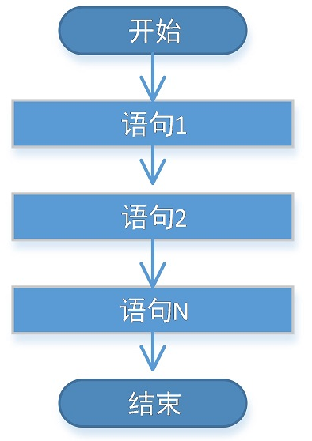
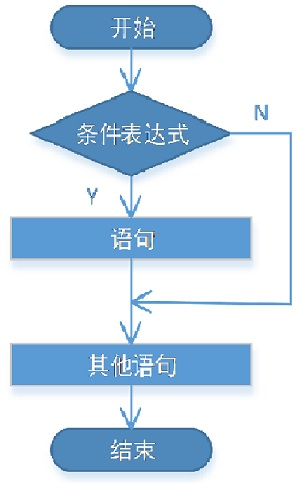
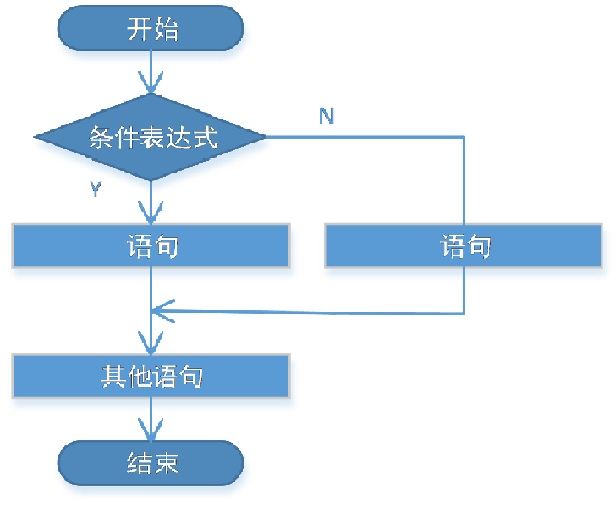
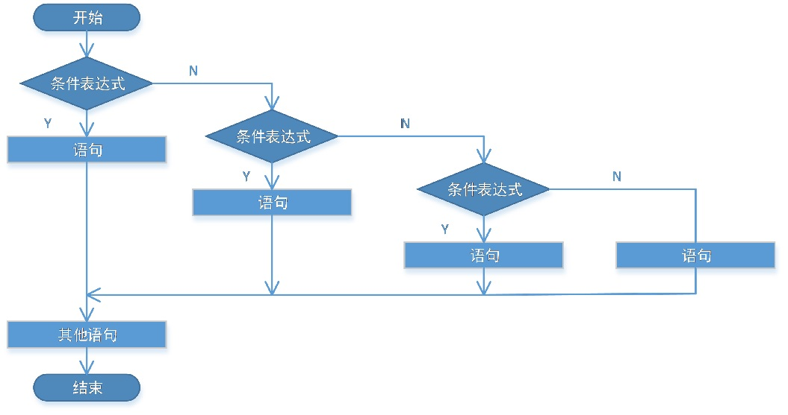
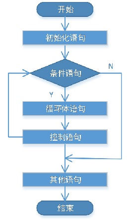
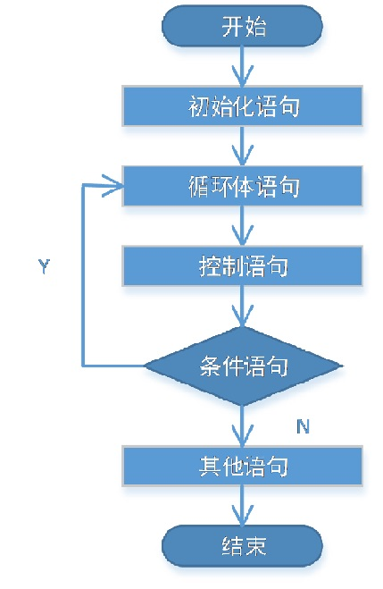
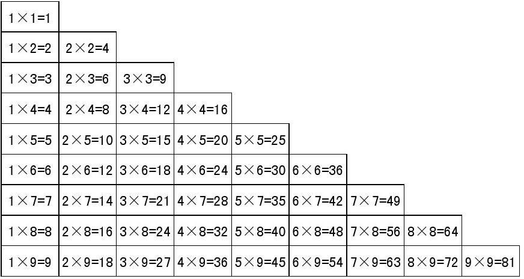

## 一、控制流程概述

> 在一个程序执行的过程中，各条语句的执行顺序对程序的结果是有直接影响，很多时候我们要通过控制语句的执行顺序来实现我们要完成的功能。
>
> 分类：
>
> * 顺序结构
> * 分支结构
> * 循环结构

## 二、顺序结构

> 特点：
>
> * 没有特定的语法结构，按照代码的先后顺序，依次执行，程序中大多数的代码都是这样执行的；
> * 写在前面的先执行，写在后面的后执行。
>
> 流程图：




```java
public class MyTest1 {
    public static void main(String[] args) {
        //顺序结构，按照从上到下的顺序执行
        System.out.println("起床");
        System.out.println("洗漱");
        System.out.println("吃早饭");
        System.out.println("上课");
        System.out.println("吃午饭");
        System.out.println("午休");
        System.out.println("上课");
        System.out.println("吃晚饭");
        System.out.println("自习");
    }
}
```

## 三、输入数据

> 实现步骤：
>
> 1. 导入`java.util.Scanner`包
>    * 语句`import java.util.Scanner;`
>    * 这句话要放在class定义的上面
> 2. 创建对象
>    * `Scanner sc = new Scanner(System.in);`
> 3. 接收数据
>    * `nextInt()`
>    * `nextLine()`
>    * `next()`

```java
//导入Scanner
import java.util.Scanner;

public class MyTest2 {
    public static void main(String[] args) {
        //创建扫描器对象
        Scanner sc = new Scanner(System.in);
        //获取键盘输入
        String next = sc.next();
        //打印测试
        System.out.println(next);
    }
}
```

## 四、分支结构

> 特点：
>
> * 有特定的语法规则
> * 代码要执行具体的逻辑运算进行判断，逻辑运算的结果有两个，所以产生选择，按照不同的选择执行不同的代码

### 4.1、if语句（三种形式）

#### 4.1.1、if

> 语法：
>
> ```java
> if(条件表达式) {
>     //语句
> }
> ```
>
> 执行流程：
>
> * 首先判断**条件表达式**看其结果是`true`还是`false`；
> * 如果是`true`就执行语句体，如果是`false`就不执行语句体。



> 注意：
>
> * 条件表达式无论简单还是复杂，结果必须是`boolean`类型
> * `if`语句控制的语句体如果是一条语句，大括号可以省略；如果是多条语句，就不能省略，建议永远不要省略。

```java
import java.util.Scanner;

public class MyTest3 {
    public static void main(String[] args) {
        Scanner sc = new Scanner(System.in);
		//获取键盘输入
		int flag = sc.nextInt();
        
        System.out.println("起床");
        System.out.println("洗漱");
        System.out.println("吃早饭");
        System.out.println("上课");
        System.out.println("吃午饭");
        System.out.println("午休");
        System.out.println("上课");
        System.out.println("吃晚饭");
        System.out.println("是否需要上自习？是，输入1；否，输入其他数字");
		int flag = sc.nextInt();
        //分支结构
        if(flag == 1) {
            System.out.println("自习");
        }
    }
}
```

#### 4.1.2、if...else...

> 语法：
>
> ```java
> if(条件表达式) {
>     //语句1
> } else {
>     //语句2
> }
> ```
>
> 执行流程：
>
> * 首先判断条件表达式看其结果是`true`还是`false`
> * 如果是`true`就执行语句1
> * 如果是`false`就执行语句2



```java
import java.util.Scanner;

public class MyTest4 {
    public static void main(String[] args) {
        Scanner sc = new Scanner(System.in);
		//获取键盘输入
		int flag = sc.nextInt();
        
        System.out.println("起床");
        System.out.println("洗漱");
        System.out.println("吃早饭");
        System.out.println("上课");
        System.out.println("吃午饭");
        System.out.println("午休");
        System.out.println("上课");
        System.out.println("吃晚饭");
        System.out.println("是否需要上自习？是，输入1；否，输入其他数字");
		int flag = sc.nextInt();
        //分支结构
        if(flag == 1) {
            System.out.println("自习");
        } else {
            System.out.println("happy");
        }
    }
}
```

#### 4.1.3、if...else if...else if...else

> 语法：
>
> ```java
> if(条件表达式1) {
>     //语句1
> } else if(条件表达式2) {
>     //语句2
> } else if(条件表达式3) {
>     //语句3
> } else {
>     //语句4
> }
> ```
>
> 执行流程：
>
> * 首先判断条件表达式1看其结果是`true`还是`false`
> * 如果是`true`就执行语句体1
> * 如果是`false`就继续判断条件表达式2看其结果是`true`还是`false`
> * 如果是`true`就执行语句体2
> * 如果是`false`就继续判断条件表达式…看其结果是`true`还是`false`
> * .…
> * 如果没有任何条件表达式为`true`，就执行语句体n+1



```java
import java.util.Scanner;

public class MyTest5 {
    public static void main(String[] args) {
        Scanner sc = new Scanner(System.in);
		//获取键盘输入
		int flag = sc.nextInt();
        
        System.out.println("起床");
        System.out.println("洗漱");
        System.out.println("吃早饭");
        System.out.println("上课");
        System.out.println("吃午饭");
        System.out.println("午休");
        System.out.println("上课");
        System.out.println("吃晚饭");
        System.out.println("选择晚饭后的活动， 1.自习 2.看电影 3.发呆  4.运动 其他值.休息");
		int flag = sc.nextInt();
        //分支结构
        if(flag == 1) {
            System.out.println("自习");
        } else if(flag == 2) {
            System.out.println("看电影");
        } else if(flag == 3) {
            System.out.println("发呆");
        } else if(flag == 4) {
            System.out.println("运动");
        } else {
            System.out.println("休息");
        }
    }
}
```

### 4.2、switch语句

> 语法：
>
> ```java
> switch(表达式) {
>  case 常量1:
>      //语句1
>      break;
>  case 常量2:
>      //语句2
>      break;
>  case 常量3:
>      //语句3
>      break;
>  default:
>      //默认语句
>      break;
> }
> ```
>
> 执行流程：
>
> * 首先计算出表达式的值；
> * 其次，和`case`后的常量依次比较，一旦有对应的值，就会执行相应的语句，在执行的过程中，遇到`break`就会结束；
> * 最后，如果所有的`case`都和表达式的值不匹配，就会执行`default`语句体部分，然后程序结束掉。
>
> 关于`switch`的说明：
>
> * `switch`(表达式)中表达式的返回值必须是下述几种类型之一：`byte，short，char，int，枚举，String`（JDK7之后支持）；
> * `case`子句中的值必须是常量，且所有`case`子句中的值应是不同的；
> * `default`子句是可任选的，当没有匹配的`case`时，执行`default`；
> * `break`语句用来在执行完一个`case`分支后使程序跳出`switch`语句块；如果没有`break`，程序会顺序执行到`switch`结尾。

```java
import java.util.Scanner;

public class MyTest6 {
    public static void main(String[] args) {
        Scanner scanner = new Scanner(System.in);
        int day = scanner.nextInt();

        switch (day) {
            case 1:
                System.out.println("上晚自习");
                break;
            case 2:
                System.out.println("上晚自习");
                break;
            case 3:
                System.out.println("上晚自习");
                break;
            case 4:
                System.out.println("上晚自习");
                break;
            case 5:
                System.out.println("上晚自习");
                break;
            case 6:
                System.out.println("不上晚自习");
                break;
            case 7:
                System.out.println("不上晚自习");
                break;
            default:
                System.out.println("输入不合法，请输入1~7之间的值");
                break;
        }
        
        /*
            switch(day) {
                case 1:
                case 2:
                case 3:
                case 4:
                case 5:
                    System.out.println("上晚自习");
                    break;
                case 6:
                case 7:
                    System.out.println("不上晚自习");
                    break;
                default:
                    System.out.println("输入不合法，请输入1~7之间的值");
                    break;
            }
        */
    }
}
```

### 4.3、if和switch比较

> if使用场景：
>
> * 针对结果是`boolean`类型的判断
> * 针对一个范围的判断
> * 针对几个常量值的判断
>
> switch语句使用场景：
>
> * 针对几个常量值的判断

## 五、循环结构

> 功能：某些条件满足的情况下，反复执行特定代码。
>
> 组成部分：
>
> * 初始化部分
>   *  一条或者多条语句，这些语句完成一些初始化操作
> * 循环条件部分
>   * 一个`boolean`表达式，这个表达式能决定是否执行循环体
> * 循环体部分
>   * 这个部分是循环体语句，也就是我们要多次做的事情
> * 控制条件语句
>   * 这个部分在一次循环体结束后，下一次循环判断条件执行前执行。通过用于控制循环条件中的变量，使得循环在合适的时候结束。

### 5.1、for循环

> 格式：
>
> ```java
> for(初始化语句; 条件语句; 控制语句) {
>     //循环体语句
> }
> ```
>
> 执行流程：
>
> 1. 执行初始化语句
> 2. 执行条件语句，看其结果是`true`还是`false`
>    * 如果是`false`，循环结束
>    * 如果是`true`，继续执行
> 3. 执行循环体语句
> 4. 执行控制语句
> 5. 回到2继续
>
> 流程图：


```java
public class MyTest7 {
    public static void main(String[] args) {
		//从1加到100
		int sum = 0;
		for(int item = 1; item <= 100; item++) {
			sum += item; // sum = sum + item;
		}
		System.out.println(sum);
        
        sum = 0;
		//求100以内的奇数和 1 3 5 7.。。
		for(int item = 1; item <= 100; item += 2) {
			sum += item;
		}
		System.out.println(sum);
    }
}
```

### 5.2、while循环

> 格式：
>
> ```java
> //初始化语句
> while(条件语句) {
>     //循环体语句
>     //控制语句
> }
> ```
>
> 流程图：



```java
public class MyTest8 {
    public static void main(String[] args) {
		//从1加到100
		int sum = 0;
		//用while循环实现从1加到100
		int item = 1;
		while(item <= 100) {
			sum += item;
			item++;
		}
		System.out.println(sum);
    }
}
```

### 5.3、do...while循环

> 格式：
>
> ```java
> do {
>     //循环体语句
> } while(条件语句);
> ```
>
> 流程图：



```java
public class MyTest9 {
    public static void main(String[] args) {
        int sum = 0;
        int i = 1;
        do {
            sum += i;
            i++;
        } while(i <= 100);
        System.out.println(sum);
    }
}
```

> `do…while`循环和`while`循环的区别
>
> * `do…while`循环至少会执行一次循环体
> * `while`循环只有在条件成立的时候才执行循环体

### 5.4、无限循环

> 不会停止的循环，也被称为死循环。
>
> 格式：
>
> ```java
> for(;;) {
>     //循环体
> }
> 
> while(true) {
>     //循环体
> }
> 
> do {
>     //循环体
> } while(true);
> ```

```java
public class MyTest10 {
    public static void main(String[] args) {
        for(;;) {
            System.out.println("hello world");
        }
    }
}
```

> 在DOS终止程序快捷键：`ctrl+c`

### 5.5、循环嵌套

> 定义：循环包含循环。
>
> 说明：
>
> * 嵌套循环就是把内层循环当成外层循环的循环体。当只有内层循环的循环条件为false时，才会完全跳出内层循环，才可结束外层的当次循环，开始下一次的循环。
> * 设外层循环次数为`m`次，内层为`n`次，则内层循环体实际上需要执行`m*n=mn`次。

```java
public class MyTest11 {
    public static void main(String[] args) {
        int m = 6;
		//在dos窗口m行打印m个*
		for(int i = 0; i < m; i++) { //打印m行
			for(int j = 0; j < i+1; j++) { 
				System.out.print("*");
			}
			System.out.print('\n');
		}
    }
}
```

> 打印99乘法表



```java
public class MyTest12 {
    public static void main(String[] args) {
		//打印99乘法表
		for(int i = 1; i <= 9; i++) {//打印9行 i用来控制行	
			for(int j = 1; j <= i; j++) { //打印同一行的算式
				System.out.print(i + "*" + j + "=" + i * j + "\t"); //"加法" 字符串拼接
			}
			System.out.print('\n');
		}
    }
}
```

### 5.6、特殊控制流程

#### 5.6.1、break

> 使用场景
>
> * 在选择结构`switch`语句中
> * 在循环语句中
>
> 作用
>
> *  跳出`switch`
> * 跳出循环

```java
for(int i = 1; i <= 9; i++) {//打印9行 i用来控制行
    //只打印前四行，到第五行结束
    if(i == 5) {
        break; //结束当前循环 
    }
    for(int j = 1; j <= i; j++) { //打印同一行的算式
        System.out.print(i + "*" + j + "=" + i * j + "\t"); //"加法" 字符串拼接
    }
    System.out.print('\n');
}
```

#### 5.6.2、continue

> 使用场景
>
> * 在循环语句中
>
> 作用
>
> * 进行下一次循环
>
> 单层循环对比`break`
>
> * `break`退出当前循环
> * `continue`进行下一次循环

```java
//打印99乘法表
for(int i = 1; i <= 9; i++) {//打印9行 i用来控制行
    //不打印第五行
    if(i == 5) {
        continue; //强行进行下一次循环
    }

    for(int j = 1; j <= i; j++) { //打印同一行的算式
        System.out.print(i + "*" + j + "=" + i * j + "\t"); //"加法" 字符串拼接
    }
    System.out.print('\n');
}
```

#### 5.6.3、return

> return关键字不是为了跳转出循环体，更常用的功能是结束一个方法，也就是退出一个方法。跳转到上层调用的方法。这个在方法的使用那里会在详细的讲解。
>
> 案例（登录程序，只输入密码）
>
> * 输入密码正确，提示登录成功
> * 输入密码错误，提示密码输入错误，重新输入
> * 输入密码错误达到3次，提示输入密码错误达到3次，程序退出

```java
import java.util.Scanner;
public class MyTest13 {
	/*输入密码，输入正确，显示登录成功 admin
		输入错误，提示“密码输入错误，请重新输入”
		密码输入错误达到3次 ==3，提示“密码输入错误超过三次，账户锁定”，程序退出*/
	public static void main(String[] args) {
		Scanner sc = new Scanner(System.in);
		int count = 0;
		while(true) {
			String pwd = sc.nextLine(); //获取输入的密码
			//判断是否输入正确
			if(pwd.equals("admin")) { //密码输入正确，判断字符串内容相等使用equals
				//登录成功
				break;
			} else { //密码输入错误
				count++;
				if(count == 3) {
					System.out.println("密码输入错误达到三次，账户锁定");
					return;
				}
				System.out.println("密码输入错误，请重新输入");
			}
		}
		System.out.println("登录成功");
	}
}
```


