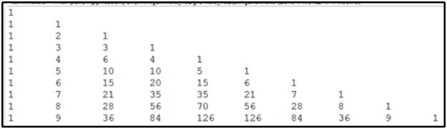

## 一、问题引入

> 现在需要统计某项目组员工的工资情况，例如计算平均工资。假设该项目组有5名员工，你会如何解决？
>
> 上述问题中，如果员工人数变为60人，甚至更多人呢？

## 二、什么是数组

> 数组是存储**同一种数据类型**多个元素的**集合**，也可以看成是一个**容器**。
>
> 数组既可以存储**基本数据类型**，也可以存储**引用数据类型**。
>
> 数组属于**引用类型**，可以理解为对象(Object)，数组中的每个元素相当于该对象的成员变量。
>
> **数组一旦初始化，长度不可变**。数组长度：`数组名.length`。

## 三、数组的定义和初始化

### 3.1、数组定义

> 两种格式：
>
> * `数据类型[] 数组名;`
> * `数据类型 数组名[];`
>
> 注意：这两种定义做完了，数组中是没有元素值的。

### 3.2、数组初始化

> Java中的数组必须先初始化，然后才能使用。
>
> 所谓初始化：就是为数组中的数组元素**分配内存空间**，并**为每个数组元素赋值**。

#### 3.2.1、动态初始化

> 动态初始化：初始化时只指定数组长度，由系统为数组分配初始值。
>
> 格式：`数据类型[] 数组名 = new 数据类型[数组长度];`
>
> 数组长度其实就是`数组中元素的个数`，每个数组都有一个属性`length`指明它的长度
>
> ```java
> //定义了一个int类型的数组，这个数组中可以存放3个int类型的值
> int[] arr = new int[3];
> ```
>
> 输出数组中元素的值
>
> * 数组中的每个元素都是有编号的，并且是从0开始。最大编号是：`数组的长度-1`。
> * 数组名和编号的配合就可以获取数组中的指定编号的元素。这个编号的专业叫法：`索引（下标）`。
> * 通过数组名访问数据的格式是：`数组名[下标]`。
>
> 关于初始值：
>
> * 存放基本数据类型数据的数组每个元素的初始值
>   * `int`：0
>   * `byte`：0
>   * `short`：0
>   * `long`：0
>   * `float`：0.0
>   * `double`：0.0
>   * `char`：
>   * `boolean`：`false`
> * 存放引用数据类型数据的数组每个元素的初始值：`null`

```java
public class MyTest1 {
    public static void main(String[] args) {
        /*
			定义数组：
				数据类型[] 数组名; ****
				数据类型 数组名[];
				
				数据类型----存放的内容的类型
				采用这两种方式定义的数组，没有内容
		*/
		int[] a1;
		int a2[];
        
       	//动态初始化及初始值
        //基本数据类型
		int[] arr1 = new int[10];
		System.out.println(arr1[5]);
		
		byte[] barr = new byte[10];
		System.out.println(barr[0]);
		
		short[] sarr = new short[10];
		System.out.println(sarr[0]);
		
		long[] larr = new long[10];
		System.out.println(larr[0]);
		
		float[] farr = new float[10];
		System.out.println(farr[0]);
		
		double[] darr = new double[10];
		System.out.println(darr[0]);
		
		char[] carr = new char[10];
		System.out.println(carr[0] + 0);
		
		boolean[] blarr = new boolean[10];
		System.out.println(blarr[0]);
        
        //引用数据类型
		String[] strArr = new String[10];
		System.out.println(strArr[3]);
        
        //数组的长度
        System.out.println(strArr.length);
    }
}
```

#### 3.2.2、静态初始化及遍历

> 静态初始化：初始化时指定每个数组元素的初始值，由系统决定数组长度。
>
> 格式： `数据类型[] 数组名 = new 数据类型[]{元素1,元素2,…};`
>
> ```java
> //定义了一个int类型的数组，这个数组中可以存放3个int类型的值，并且值分别是1,2,3。
> int[] arr = new int[]{1,2,3}; 
> //简化写法 int[] arr = {1,2,3}
> ```

```java
public class MyTest2 {
    public static void main(String[] args) {
  		//静态初始化
		int[] arr1 = new int[]{1, 2, 5, 0};
		System.out.println(arr1[3]);
		int[] arr2 = {9, 8, 7, 6};
		System.out.println(arr2[3]);
        
        //数组的遍历
        for(int index = 0; index < arr1.length; index++) {
            System.out.println(arr1[index]);
        }
    }
}
```

### 3.4、常见问题

> 数组索引越界异常
>
> * `ArrayIndexOutOfBoundsException`
> * 访问到了数组中的不存在的索引时发生
>
> 空指针异常
>
> * `NullPointerException`
> * 数组引用没有指向实体，却在操作实体中的元素时

```java
public class MyTest3 {
    public static void main(String[] args) {
  		//静态初始化
		int[] arr1 = new int[]{1, 2, 5, 0};
		System.out.println(arr1[4]);
		int[] arr2 = null;
        System.out.println(arr2[0]);
    }
}
```

### 3.5、关于数组长度不可变

```java
public class MyTest4 {
	public static void main(String[] args) {
		int a = 10;
		int b = 100;
		/*
			数据类型[] 数组名 = new 数据类型[数组的长度];
			数组名是存放在栈上的
			数组名也被叫做引用
		*/
		int[] arr1 = new int[5];
		
		/*数组的遍历
			数组的长度：数组名.length
		*/
		for(int index = 0; index < arr1.length; index++) {
			System.out.println(arr1[index]);
		}
		
		arr1[1] = 10;
		System.out.println("*****************");
		for(int index = 0; index < arr1.length; index++) {
			System.out.println(arr1[index]);
		}
		
		int[] arr2 = new int[5];
		/*
			两个引用同时指向了一个数组
			两个引用和同一个数组建立了关联
		*/
		arr2 = arr1;//赋值
		System.out.println("*****************");
		for(int index = 0; index < arr2.length; index++) {
			System.out.println(arr2[index]);
		}
		arr2[1] = 1000;
		System.out.println("*****************");
		for(int index = 0; index < arr1.length; index++) {
			System.out.println(arr1[index]);
		}
		arr1 = null;
		arr2 = null;
			
		/*
			垃圾回收
		*/		
		arr1 = new int[3];
    }
}
```

> 引用可以更改关联的堆空间，但是堆空间本身是不可变的。

#### 3.5.1、数组类型的参数

```java
public class MyTest5 {
    public static void printNumber(int a) {
         System.out.println(a);
    }
    
    public static void printArray(int[] arr) {
        for (int i = 0; i < arr.length; i++) {
            System.out.println(arr[i]);
        }
    }

    public static void main(String[] args) {
        int num = 100;
        printNumber(num);
        
        int[] nums = {2, 3, 5, 0, 1};
        printArray(nums);
    }
}
```

> 方法调用时，将nums中的地址赋值给arr，此时二者指向同一个数组；
>
> 传递参数时：**基本数据类型传递的是变量中的值；引用类型传递的是变量中的地址。**

#### 3.5.2、数组类型的返回值

```java
import java.util.Arrays;

public class MyTest6 {
    //创建长度为两倍的新数组，并保留原数据
    public static int[] expandArray(int[] arr) {
        int[] arr1 = new int[arr.length * 2];
        for (int i = 0; i < arr.length; i++) {
            arr1[i] = arr[i];
        }
        return arr1;
    }

    public static void main(String[] args) {
        int[] arr = {2, 3, 5, 0, 1};
        System.out.println(Arrays.toString(expandArray(arr)));
    }
}
```

> 调用数组类型返回值的方法时，方法执行后，返回的是数组的地址。

### 3.6、可变长参数

> 概念：可接收多个同类型实参，个数不限，使用方式与数组相同。
>
> 语法：`数据类型... 参数名`
>
> 注意：必须定义在形参列表的最后，且只能有一个。

```java
public class MyTest7 {
    public static void printArray(int... args) {
        for (int i = 0; i < args.length; i++) {
            System.out.println(args[i]);
        }
    }

    public static void main(String[] args) {
        //int[] arr = {2, 3, 5, 0, 1};
        //printArray(arr);
        printArray(1, 2, 3);
    }
}
```

## 四、数组常见操作

### 4.1、数组遍历

> 方式：
>
> * 普通`for`循环
> * `while`循环
> * 增强`for`循环

```java
public class MyTest8 {
	public static void main(String[] args) {
		int[] arr = {1, 5, 0, 9, 2};
        
        //普通for循环遍历数组
        for(int index = 0; index < arr.length; index++) {
            System.out.println(arr[index]);
        }
        
        //while循环遍历数组，普通for循环和while循环可以相互转换
        int index = 0;
        while(index < arr.length) {
            System.out.println(arr[index]);
            index++;
        }
        
        /*
        	增强for循环
        	for(数据类型 变量 : 数组) {
        		循环体
        	}
        	每次循环，会将数组中的元素依次赋值给变量
        */
        for(int item : arr) {
			System.out.println(item);            
        }
    }
}
```

### 4.2、求最值

```java
public class MyTest9 {
	public static void main(String[] args) {
		//获取数组的最值 最大值 最小值
		int[] arr = {-5, -1, -3, -4};
		
		//假定一个最大值
		int max = arr[0];//假定数组当中的某个元素是最大的元素
		for(int i = 0; i < arr.length; i++) {
			if(max < arr[i]) {
				max = arr[i];
			}
		}
		System.out.println(max);
    }
}
```

### 4.3、数组逆序

```java
public class MyTest10 {
	public static void main(String[] args) {
		/*			
			数组逆序---逆序存储
			[1, 2, 3, 4]
			[4, 3, 2, 1]
			
			前面的位置和后面对应的位置存放的内容交换
						|
			找到前面的位置和后面对应的位置
						|
			找到前面元素的下标和后面元素的下标
						|
			如何交换元素的值
			int a = 10;
			int b = 100;
			
			int temp = a;
			a = b;
			b = temp;
		*/
		int[] arr = {1, 2, 3, 4};
		
		/*
			定义了两个下标
			head：前面元素的下标
			tail: 后面元素的下标
		*/
		for(int head = 0, tail = arr.length-1; head < tail; head++, tail--) {
			//交换
			int temp = arr[head];
			arr[head] = arr[tail];
			arr[tail] = temp;
		}
		
		for(int item : arr) {
			System.out.println(item);
		}
	}
}
```

### 4.4、数组元素查找

> 查找指定元素第一次在数组中出现的索引

```java
public class MyTest11 {
	public static void main(String[] args) {
		int[] arr = {1, 2, 4, 2};
		/*
			查找元素首次出现的索引,并打印
			如果没有找到这个元素，打印“该数组中不存在该元素”
		*/
		int a = 6;
		boolean flag = false;//假设没有找到
		for(int i = 0; i < arr.length; i++) {
			if(arr[i] == a) {
				System.out.println(i);
				flag = true;
				break;
			}
		}
		
		if(flag == false) {
			System.out.println("数组中不存在该元素");
		}
	}
}
```

### 4.5、数组复制

>方式：
>
>* 循环将原数组中所有元素逐一复制到新数组；
>* `System.arraycopy(Object src, int srcPos, Object dest, int destPos, int length);`
>* `Arrays.copyOf(原数组，新长度);`

```java
import java.util.Arrays;

public class MyTest12 {
	public static void main(String[] args) {
        int[] arr = {5, 4, 9, 2, 3};
        int[] arr1 = new int[arr.length];
        
        //循环将原数组中所有元素逐一复制到新数组
        for(int index = 0; index < arr.length; index++) {
            arr1[index] = arr[index];
        }
		//打印数组
        System.out.println(Arrays.toString(arr1));

        //System.arraycopy
        arr1 = new int[arr.length];
        System.arraycopy(arr, 0, arr1, 0, arr.length);
        System.out.println(Arrays.toString(arr1));

        //Arrays.copyOf
        int[] arr2 = Arrays.copyOf(arr, 20);
        System.out.println(Arrays.toString(arr2));
	}
}
```

### 4.6、数组排序

#### 4.6.1、选择排序

> 选定一个元素和其后的元素比较

```java
public class MyTest13 {
	public static void main(String[] args) {
		/*
        	选择排序
				1.选定元素和其后的元素进行比较;
				2.选定的元素？除了最后一个元素。
		*/
		int[] arr = {5, 4, 9, 2, 3};
		for(int i = 0; i < arr.length - 1; i++) {//i表示被选定元素的下标
			for(int j = i+1; j < arr.length; j++) {//j表示和选定的元素进行比较的元素----"其后的元素"
				//比较
				if(arr[i] > arr[j]) {
					int temp = arr[i];
					arr[i] = arr[j];
					arr[j] = temp;
				}
			}
		}
		
		//打印输出
		for(int item : arr) {
			System.out.println(item);
		}
	}
}
```

#### 4.6.2、冒泡排序

> 相邻的元素两两进行比较

```java
public class MyTest14 {
	public static void main(String[] args) {
		/*
			冒泡排序
				相邻元素两两进行比较
				n个元素 n-1轮
				
			对于一个已经排好顺序的数组，如何简化比较
					|
				没有排序的数组，肯定会进行交换---会进入if
					|
				判断是否进入if，如果没有进入if，直接跳出最外层的循环，简化比较
		*/
		//int[] arr = {5, 4, 9, 2, 3};
		int[] arr = {1, 3, 2, 4, 5};
		/*
			标志位
				true 表示进入了if---进行了交换
				false 没有进入if---没有进行交换
		*/
		boolean flag = false; //假设数组已经排好顺序
		
		for(int i = 0; i < arr.length-1; i++) {//轮数
			//System.out.println("********************");
			/*
				每一轮相邻的元素两两进行比较
				-i 每一次选定的元素比上一轮少一个
			*/
			for(int j = 0; j < arr.length - 1 - i; j++) {//j表示前面的元素
				if(arr[j] > arr[j+1]) {
					int temp = arr[j];
					arr[j] = arr[j+1];
					arr[j+1] = temp;
					
					flag = true;
				}
			}
			
			if(flag == false) {
				break;
			} else {
				flag = false; //重置标志位
			}
		}
		
		//打印输出
		for(int item : arr) {
			System.out.println(item);
		}
	}
}
```

## 五、二维数组

### 5.1、什么是二维数组

> 数组中包含数组
>
> 本质是一维数组，每个元素是一维数组

### 5.2、二维数组定义及初始化

```java
public class MyTest15 {
	public static void main(String[] args) {
		/*
			4行3列
			该数组中包含4个一维数组，每个一维数组包含3个元素
		*/
		int[][] arr = new int[4][3];//动态初始化
		//System.out.println(arr.length);
		for(int i = 0; i < arr.length; i++) { //行
			for(int j = 0; j < arr[i].length; j++) {
				System.out.println(arr[i][j]);
			}
		}
		
		/*
			二维数组每一行的长度可以不相同
		*/
		int[][] arr1 = new int[3][];//动态初始化
		arr1[0] = new int[10];
		arr1[1] = new int[9];
		arr1[2] = new int[11];
		
		
		//int[] arr = new int[]{...};
		//int[][] arr2 = new int[][]{{1, 2, 3}, {4, 5}, {0, 0 ,0}};
		int[][] arr2 = {{1, 2, 3}, {4, 5}, {0, 0 ,0}};
		for(int i = 0; i < arr2.length; i++) {
			for(int j = 0; j < arr2[i].length; j++) {
				System.out.print(arr2[i][j] + "\t");
			}
			System.out.println();
		}
	}
}
```

### 5.3、杨辉三角



```java
public class MyTest16 {
	public static void main(String[] args) {
		int[][] arr = new int[10][];
		for(int i = 0; i < arr.length; i++) {
			arr[i] = new int[i + 1];
			for(int j = 0; j < arr[i].length; j++) {
				if(j == 0 || j == arr[i].length - 1) {
					arr[i][j] = 1;
				} else {
					arr[i][j] = arr[i - 1][j - 1] + arr[i - 1][j];
				}
			}
		}
		
		for(int i = 0; i < arr.length; i++) {
			for(int j = 0; j < arr[i].length; j++) {
				System.out.print(arr[i][j] + "\t");
			}
			System.out.println();
		}
	}
}
```

