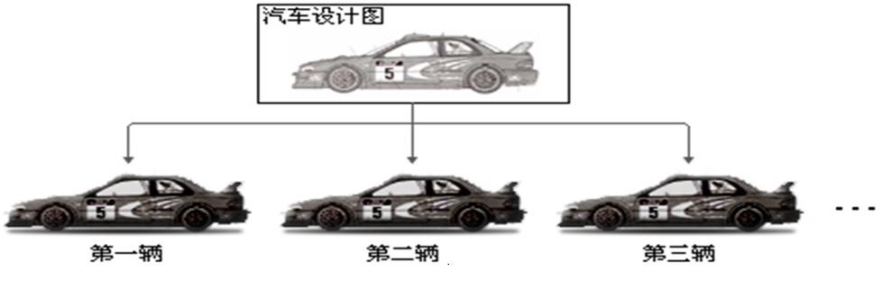

## 一、类和对象

### 1.1、什么对象

> 面向对象编程（Object Oriented Programming）
>
> * 一切客观存在的事物（一辆车、一本书、一个人）都是对象，万事万物皆对象；
> * 任何对象，一定具有自己的特征和行为。
>
> **对象**是实际存在的该类事务的每个个体，因而也称实例(instance)。

### 1.2、什么是类

> **类**是对一类事物描述，是抽象的、概念上的**定义**。

### 1.3、类和对象的关系



> Java的类用于**描述**现实生活中的事物，生活中，在车间通过图纸造汽车。JAVA里面通过类设计汽车，通过new关键字来创建汽车。生活中的汽车在马路上面跑。Java中的汽车在内存中跑。
>
> **对象**：汽车
>
> **类**：汽车的设计图纸

### 1.4、为什么设计类

> 基本数据类型无法满足程序设计的要求，我们需要自定义类型满足程序设计的要求，类其实就是一种**自定义的类型**。

## 二、类的组成与创建对象

```java
[修饰符] class 类名 {
    属性
    [构造方法]
    方法    
}
```

> **修饰符**：可以省略，目前我们暂时填写`public`；
>
> **类名**：要符合标识符的命名规范。
>
> **属性**描述了**类**描述的事物所具有的特性，代表**有什么**。
>
> **方法**描述了**类**描述的事物所具有的动作，代表**能做什么**。

### 2.1、属性

```java
[修饰符] 数据类型 属性名 [= 初始值];
```

> **修饰符**：可以省略，目前我们暂时填写`public`；
>
> **数据类型**：任意的数据类型，可以是基本数据类型也可以是引用数据类型；
>
> **属性名**：属性的名字，要符合标识符的命名规范；
>
> **初始值**：在设计类时，可以为属性指定初始值，也可以不指定初始值，如果不指定，那么属性有默认的初始值。
>
> 属性有时也被称为：成员变量，数据成员。

### 2.2、方法

```java
[修饰符] 返回值类型 方法名(参数类型 参数名1，参数类型 参数名2…) {
    方法体;
    return 返回值;
}
```

> **修饰符**：比较多，后面会详细介绍。目前我们暂时填写`public`；
>
> **方法名**：一个名字，为了方便我们调用方法，要符合标识符的命名规范，见名知意；
>
> **参数类型**：限定调用方法时传入参数的数据类型；
>
> **参数名**：接收调用方法时传入的参数，要符合标识符的命名规范，见名知意；
>
> **方法体**：完成功能的代码；
>
> **return**：结束方法以及返回方法指定类型的值；
>
> **返回值类型**：用于限定返回值的数据类型。如果没有返回值，返回值类型为`void`，此时`return`语句有如下两种写法：
>
> - `return;`
> - 可以不写`return`语句
>
> **返回值**，程序被`return`带回的结果，返回给调用者。

```java
package tech.code2048.test1;

/*
 * 类的定义
 * 
 * 修饰符 class 类名 {
 * 		属性-----特性-----成员变量
 * 		构造方法
 * 		方法-----动作-----能做什么事情-----成员方法
 * }
 * 
 * 方法
 * 	修饰符 返回值类型 方法名(参数列表) {
 * 		方法体
 * 		return 返回值;
 * 	}
 * 属性
 * 	修饰符 数据类型 属性名 = 初始值;
 * */
//表示人的类
public class Person {
	public String name;// 姓名
	public int age;// 年龄
	public String gender;// 性别
	public String id;// 身份证号
	public String tel;// 电话

	// 跑步
	public void running() {
		/*
		 * 类中的方法可以直接访问类的属性
		 */
		System.out.println(name + " running....");
	}

	// 学习
	public void learn() {
		System.out.println("learn....");
	}
}

```

### 2.3、对象的创建和使用

> 使用`new`关键字创建一个新的对象；
>
> 使用`对象名.对象成员`的方式访问对象成员（包括属性和方法）；
>
> 如果创建了一个类的多个对象，对于类中定义的属性，每个对象都拥有各自的一套副本，且**互不干扰**；
>
> 对象创建后，属性会被赋初值，默认的初始值如下：
>
> - 存放基本数据类型数据成员变量的初始值
>   - `int`：0
>   - `byte`：0
>   - `short`：0
>   - `long`：0
>   - `float`：0.0
>   - `double`：0.0
>   - `char`：`'\u0000'`
>   - `boolean`：`false`
> - 存放引用数据类型数据成员变量的初始值：`null`

```java
public class MyTest1 {

	public static void main(String[] args) {
		/*
		 * 如何根据类创建对象
		 * new+构造方法
		 * 构造方法-----方法名和类名相同
		 * 
		 * new Person();
		 * */
		int a = 10;
		//创建表示人的对象
		/*
		 * p1、p2、p3----对象名、对象的引用
		 * 他们并不是对象本身
		 * */
		Person p1 = new Person();
		Person p2 = new Person();
		Person p3 = new Person();
		/*
		 * 对象名.成员----访问对象中的属性和方法
		 * */
		p1.name = "zhangsan";//修改p1的name
		/*
		 * 在不同类当中访问类的属性，需要先创建类的对象，然后根据类的对象访问属性
		 * */
		System.out.println(p1.name);//打印p1的name
		p1.running();
		p1.learn();
		/*
		 * 每个对象是单独的个体，修改一个对象的属性后，其他对象的属性不受影响
		 * */
		p2.name = "wangwu";
		System.out.println(p1.name);
		/*
		 * 对象创建之后，对象的属性会被赋初值
		 * int----0
		 * byte---0
		 * long---0
		 * short--0
		 * char---0
		 * double-0.0
		 * float--0.0F
		 * boolearn---false
		 * 引用----null
		 * */
		System.out.println(p3.name);
		System.out.println(p3.age);
		
		p3 = p1;
		p3.name = "Tom";
		System.out.println(p1.name);
		p1 = null;
		p2 = null;
		
		int b = 0;
		System.out.println(b);
		
		int x = 10;
		System.out.println(x);//10
		//基本数据类型参数的传递
		chg(x);
		System.out.println(x);//10
		
		Demo dm = new Demo();
		dm.x = 1;
		System.out.println(dm.x);
		//引用数据类型参数传递
		//d = dm
		chg(dm);
		System.out.println(dm.x);//1000
		
		
		Person p4 = new Person();
		p4.age = 10;
		p4.addAge(2);
		System.out.println(p4.age);
	}
	
	//a = x
	public static void chg(int a) {
		a = 1000;
	}
	
	public static void chg(Demo d) {
		d.x = 1000;
	}
}

//Demo类
public class Demo {
    public int x;
}
```

> **值传递（传值）**：当基本类型作为参数传入方法时，无论该参数（原型变量的一个值得拷贝）在方法内怎样被改变，外部的变量原型总是不变的。
>
> **引用传递**：当引用作为参数传入方法时，通过引用在方法内部修改引用关联的数据，数据本身会被修改。

### 2.4、类的访问机制

> **在一个类中的访问机制**：类中的方法可以直接访问类中的成员变量。**例外：static方法访问非static，编译不通过**。
>
> **在不同类中的访问机制**：先创建要访问类的对象，再用对象访问类中定义的成员。

### 2.5、成员变量和局部变量

|          | 成员变量                                           | 局部变量                                           |
| -------- | -------------------------------------------------- | -------------------------------------------------- |
| 定义位置 | 类的内部，方法的外部                               | 方法或方法内的代码块中                             |
| 默认值   | 有默认值，和数组元素默认值相同                     | 没有默认值                                         |
| 生命周期 | 成员变量随着对象的创建而产生，随着对象的消失而消失 | 局部变量随着区域的执行而存在，随着区域的结束而释放 |
| 使用范围 | 成员变量定义在类中，整个类中都可以使用             | 局部变量定义在方法代码块中，只在所属的区域有效     |

## 三、方法重载

> 在**同一个类**中，允许存在一个以上的**同名**方法，只要它们的**参数个数或者参数类型**不同即可。
>
> 特点：
>
> - 与返回值类型无关，只看方法名和参数列表；
> - 在调用时，JVM通过参数列表的不同来区分同名方法。

```java
public class Person {
	public String name;// 姓名
	public int age;// 年龄
	public String gender;// 性别
	public String id;// 身份证号
	public String tel;// 电话

	// 跑步
	public void running() {
		/*
		 * 类中的方法可以直接访问类的属性
		 */
		System.out.println(name + " running....");
	}

	// 学习 - 方法重载
	public void learn() {
		System.out.println("learn....");
	}
    
    // 学习 - 方法重载
   	public void learn(String subject) {
        System.out.println("learn..." + subject);
    }
}
```

> 测试方法重载

```java
public class MyTest2 {
    public static void main(String[] args) {
        //创建对象
        Person p1 = new Person();
        //调用方法
        p1.learn();
        //调用方法
        p1.learn("JavaSE");
    }
}
```

## 四、构造方法

### 4.1、是什么

> 类中的特殊方法，主要用于创建对象，在对象创建时被调用。
>
> 当一个类的实例对象刚产生时，这个类的构造方法就会被自动调用，我们可以在这个方法中加入要完成初始化工作的代码。

### 4.2、作用和特点

> 作用：
>
> * 给对象进行初始化。
>
> 特点：
>
> * 方法名与类名相同；
> * 不用定义返回值类型；
> * 没有具体的返回值。

### 4.3、构造方法相关细节

> 1. **不管有没有显式定义构造方法，创建对象都必须要通过构造方法初始化**；
> 2. **一个类中如果没有定义过构造方法，那么该类中会有一个默认的空参数构造方法**；
> 3. **如果在类中定义了有参的构造方法，那么类中的默认构造方法会被覆盖，如果此时需要使用无参的构造方法，则要手动定义**；
> 4. 构造方法可以有多个，用于对不同的对象进行针对性的初始化；
> 5. 多个构造方法在类中是以重载的形式来体现的。

```java
public class Person {
	public String name;// 姓名
	public int age;// 年龄----私有的
	public String gender;// 性别
	public String id;// 身份证号
	public String tel;// 电话

	/*	构造方法
	 * 	1.方法名和类名相同
	 * 	2.不用定义返回值类型
	 * 	3.在对象被创建的时候调用
	 * 	4.不管有没有定义构造方法，创建对象时都会调用构造方法进行初始化
	 * 	5.如果一个类中没有定义构造方法，那么该类中存在默认的无参的构造方法
	 * 		public Person() {
	 * 
	 * 		}
	 *  6.如果在类中自定义了构造方法，那么默认的构造方法会被覆盖
	 *  	如果想使用默认的构造方法要如何做？----自己手写一个默认的构造方法
	 * */
	/*public Person() {
		System.out.println("创建Person对象");
	}*/
	/*
	 * 默认的构造方法
	 * */
	public Person() {
		
	}
	/*
	 * 带参数的构造方法
	 * */
    public Person(String n) {
        name = n;
    }

    //带参数的构造方法
    public Person(String n, int a, String g, String i, String t) {
        name = n;
        age = a;
        gender = g;
        id = i;
        tel = t;
    }
	
	// 跑步
	public void running() {
		/*
		 * 类中的方法可以直接访问类的属性
		 */
		System.out.println(name + " running....");
	}

	// 学习 - 方法重载
	public void learn() {
		System.out.println("learn....");
	}
    
    // 学习 - 方法重载
   	public void learn(String subject) {
        System.out.println("learn..." + subject);
    }
}
```

> 测试构造方法

```java
public class MyTest3 {
    public static void main(String[] args) {
        Person p= new Person("张三");
        System.out.println(p.name);

        Person p1 = new Person("ls", 20, "男", "111", "1111");
        System.out.println(p1.name);
        System.out.println(p1.age);
        System.out.println(p1.gender);
        System.out.println(p1.id);
        System.out.println(p1.tel);
    }
}
```

## 五、this关键字

> 功能：
>
> * 表示当前对象；
> * 表示构造方法

### 5.1、表示当前对象

> `this`可以用来指代当前对象，**当成员变量和局部变量重名，可以用关键字this来区分**。

```java
package tech.code2048.test2;

public class Person {
    public String name;// 姓名
    public int age;// 年龄
    public String gender;// 性别
    public String id;// 身份证号
    public String tel;// 电话

    //默认的构造方法 - 没有参数
    public Person() {
    }

    //带参数的构造方法
    //当成员变量和局部变量重名，可以用关键字this来区分
    public Person(String name) {
        this.name = name;
    }

    //带参数的构造方法
    //当成员变量和局部变量重名，可以用关键字this来区分
    public Person(String name, int age, String gender, String id, String tel) {
        this.name = name;
        this.age = age;
        this.gender = gender;
        this.id = id;
        this.tel = tel;
    }

    // 跑步
    public void running() {
        System.out.println(this.name + " running....");
    }

    // 学习 - 方法重载
    public void learn() {
        System.out.println("learn....");
    }

    // 学习 - 方法重载
    public void learn(String subject) {
        System.out.println("learn..." + subject);
    }
}
```

### 5.2、表示构造方法

> `this`也可以表示构造方法，**用于在构造函数中调用其他构造函数**。
>
> 注意：只能定义在构造函数的第一行。因为初始化动作要先执行。

```java
public class Person {
    public String name;// 姓名
    public int age;// 年龄
    public String gender;// 性别
    public String id;// 身份证号
    public String tel;// 电话

    //默认的构造方法 - 没有参数
    public Person() {
    }

    //带参数的构造方法
    /*
    *   如果定义了带参数的构造方法，则默认的无参构造方法会被覆盖(此时默认的无参构造方法无法使用)
    *   此时如果希望试用无参的构造方法，需要手动定义
    * */

    public Person(String name) {
        this.name = name;
    }

    public Person(String name, int age) {
        //this用于在构造函数中调用其他构造函数
        this(name);
        this.age = age;
    }

    public Person(String name, int age, String gender) {
        //this用于在构造函数中调用其他构造函数
        this(name, age);
        this.gender = gender;
    }

    public Person(String name, int age, String gender, String id) {
        //this用于在构造函数中调用其他构造函数
        this(name, age, gender);
        this.id = id;
    }

    //带参数的构造方法
    public Person(String name, int age, String gender, String id, String tel) {
        //this用于在构造函数中调用其他构造函数
        this(name, age, gender, id);
        this.tel = tel;
    }

    // 跑步
    public void running() {
        /*
         * 类中的方法可以直接访问类的属性
         */
        System.out.println(this.name + " running....");
    }

    // 学习 - 方法重载
    public void learn() {
        System.out.println("learn....");
    }

    // 学习 - 方法重载
    public void learn(String subject) {
        System.out.println("learn..." + subject);
    }
}
```


