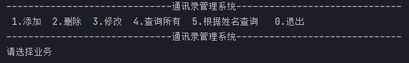
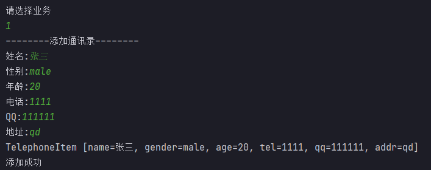
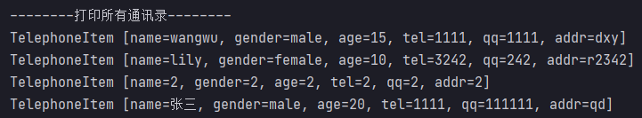
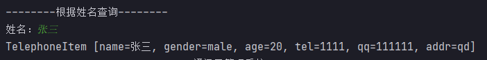
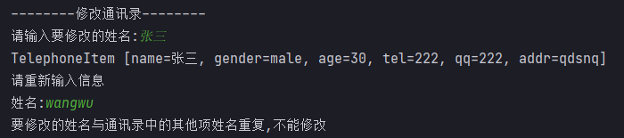
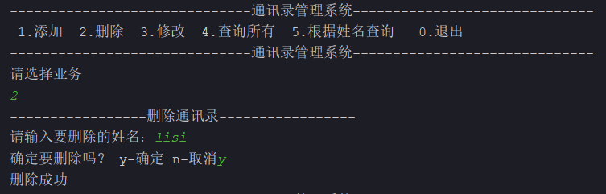
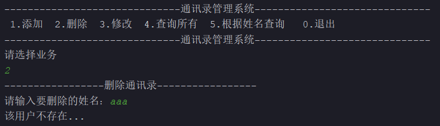

## 一、封装

### 1.1、目前存在的问题

```java
public class MyTest {
    public static void main() {
        Person person = new Person();
        person.age = 9999;
    }
}
```

> 在对象的外部，为对象的属性赋值，可能存在非法数据的录入。
>
> 使用者对类内部定义的属性直接操作会导致数据的错误、混乱或安全性问题。

### 1.2、什么是封装

> 尽可能隐藏对象的内部实现细节，控制对象的修改及访问的权限。
>
> **隐藏该隐藏的，暴露该暴露的。**

### 1.3、如何实现封装

> 将属性使用访问修饰符`private`进行修饰，被`private`修饰后，属性仅在本类可见。
>
> 提供公共的方法（被`public`修饰）`getXXX`和`setXXX`实现对该属性的操作。
>
> 在公共的访问方法内部，添加逻辑判断，进而过滤掉非法数据，以保证数据安全（可选的）。

```java
public class Person {
    private String name;// 姓名
    private int age;// 年龄
    private String gender;// 性别
    private String id;// 身份证号
    private String tel;// 电话

    public String getName() {
        return name;
    }

    public void setName(String name) {
        this.name = name;
    }

    public int getAge() {
        return age;
    }

    /*
    	在公共的访问方法内部，添加逻辑判断，
    	进而过滤掉非法数据，以保证数据安全。
    */
    public void setAge(int age) {
        if(age > 0 && age < 130) {
            this.age = age;
        } else {
            this.age = 20;
        }
    }

    public String getGender() {
        return gender;
    }

    public void setGender(String gender) {
        this.gender = gender;
    }

    public String getId() {
        return id;
    }

    public void setId(String id) {
        this.id = id;
    }

    public String getTel() {
        return tel;
    }

    public void setTel(String tel) {
        this.tel = tel;
    }
}
```

> 测试

```java
public class MyTest1 {
    public static void main(String[] args) {
        Person person = new Person();
        person.setAge(1000);
        System.out.println(person.getAge());
    }
}
```

> 总结：
>
> * 不可以直接访问属性，仅可访问公共方法；
> * `get/set`方法是外界访问对象私有属性的唯一通道，方法内部可对数据进行检验和过滤。

### 1.4、通讯录管理系统

> 实现对通讯录信息的增删改查操作。
>
> **要求，姓名是唯一的，姓名不能重复。**
>
> 主界面



> 添加



> 添加同名信息


> 查询所有



> 根据姓名查询



> 修改通讯录


> 修改通讯里，修改的名字不存在


> 修改之后的名字和其他项名字重复，不允许修改



> 删除





## 二、继承

### 2.1、什么是继承

#### 2.1.1、生活中的继承

> 生活中的`继承`是施方一种赠与，受方的一种获得。
>
> 将一方所拥有的东西给与另一方。
>
> 施方和受方往往二者具有继承关系（直系亲属、亲属）。


#### 2.1.2、程序中的继承

> 程序中的继承，是`类与类`之间特征和行为的一种`赠与或获得`。
>
> 两个类之间的继承关系，必须满足`is a`的关系。
>
> * Dog is an Animal；
> * Cat is an Animal。
>
> 根据上面的关系我们可以设计三个类，Dog、Cat、Animal
>
> * Dog继承Animal；
> * Cat继承Animal。
>
> 被继承的类称为**父类**，上述案例中的Animal。
>
> 继承的类称为**子类**，上述案例中的Dog和Cat。

#### 2.1.3、父类的选择

> 现实生活中，很多类别之间都存在着继承关系，都满足`is a`的关系。
>
> 狗是一种动物、狗是一种生物。
>
> 多个类别都可作为**狗**的父类，需要从中选择出最适合的父类。
>
> ```
> //生物
> 属性：
> 	品种、年龄、性别
> 方法：
> 	呼吸
> 	
> //动物
> 属性：
> 	品种、年龄、性别
> 方法：
> 	呼吸、吃、睡
> ```
>
> 功能越精细，重合点越多，越接近直接父类。
>
> 功能越粗略，重合点越少，越接近`Object`类。
>
> 在实际开发中，可根据程序需要使用到的多个具体类，进行共性提取，进而定义父类。
>
> ```
> //狗
> 属性：
> 	品种、年龄、性别、毛色
> 方法：
> 	吃、睡、跑
> 	
> //鱼
> 属性：
> 	品种、年龄、性别
> 方法：
> 	吃、睡、游
> 
> //鸟
> 属性：
> 	品种、年龄、性别、毛色
> 方法：
> 	吃、睡、飞
> 	
> //蛇
> 属性：
> 	品种、年龄、性别
> 方法：
> 	吃、睡、爬
> 	
> //动物
> 属性：
> 	品种、年龄、性别
> 方法：
> 	吃、睡
> ```
>
> **在一组相同或类似的类中，抽取出共性的特征和行为，定义在父类中，实现重用。**

### 2.2、如何实现继承

```java
//继承语法
class 子类名 extends 父类 { //定义子类时，指定其父类
    //属性
    //构造方法
    //方法
}
```

> 产生继承关系之后，子类可以使用父类中的属性和方法，也可以定义子类独有的属性和方法。

```java
//父类
public class Animal {
    private String variety;//品种
    private int age;//年龄
    private String gender;//性别
    
    //get和set

    //吃
    public void eat() {
        System.out.println("eat...");
    }

    //睡
    public void sleep() {
        System.out.println("sleep...");
    }
}

//子类继承父类
public class Dog extends Animal {
    private String color;//毛色
    
    //get和set

    //跑
    public void run() {
        System.out.println("run...");
    }
}
```

> 好处：提高了代码的复用性和可扩展性。
>
> * `extends`这个单词本身就具有扩展的意思，我们也可以将继承理解为扩展，父类的功能不能达到要求，使用子类实现对父类的扩展。

#### 2.2.1、关于单继承

> Java为单继承，一个类只能有一个直接父类，但可以多级继承，属性和方法逐级叠加。

```java
class 生物 {
    属性：品种、年龄、性别
    方法：呼吸
}

class 动物 extends 生物 {
    方法：吃、睡    
}

class 狗 extends 动物 {
    属性：毛色
    方法：跑    
}

=============================================================================================
//生物
public class LivingThings {
    private String variety;//品种
    private int age;//年龄
    private String gender;//性别
    
    //get和set
    
    //呼吸
    public void breath() {
        System.out.println("breath...");
    }
}

//动物
public class Animal extends LivingThings {
    //吃
    public void eat() {
        System.out.println("eat...");
    }

    //睡
    public void sleep() {
        System.out.println("sleep...");
    }
}

//狗
public class Dog extends Animal {
    private String color;//毛色
    
    //get和set

    //跑
    public void run() {
        System.out.println("run...");
    }
}
```

### 2.3、访问控制修饰符

|             | 本类 | 同包 | 非同包子类 | 其他 |
| ----------- | ---- | ---- | ---------- | ---- |
| `private`   | ✔    | ✘    | ✘          | ✘    |
| `default`   | ✔    | ✔    | ✘          | ✘    |
| `protected` | ✔    | ✔    | ✔          | ✘    |
| `public`    | ✔    | ✔    | ✔          | ✔    |

> ✔：表示可以访问；
>
> ✘：表示不可以访问；
>
> 从上到下，从严格到宽松。
>
> **关于不可继承**：
>
> * 类中的构造方法，只负责创建本类对象，不可继承；
> * `private`修饰的属性和方法，仅本类可见；
> * 父子类不在同一个`package`中时，`default`修饰的属性和方法。
>
> 关于`defualt`和`protected`验证
>
> `LivingThings`类

```java
package tech.code2048.test;

public class LivingThings {
    String variety;//品种，defualt级别
    private int age;//年龄
    private String gender;//性别

    //呼吸
    public void breath() {
        System.out.println(this.variety +  " breath...");
    }
}
```

> `Animal`类，和`LivingThings`类在同一个包下，可以访问同包下的`default`级别的属性。

```java
package tech.code2048.test;

public class Animal extends LivingThings {
    //吃
    public void eat() {
        System.out.println(this.variety + "eat...");
    }

    //睡
    public void sleep() {
        System.out.println("sleep...");
    }
}
```

> `Plant`类，和`LivingThings`类不在同一个包下，不可以访问同包下的`default`级别的属性。

```java
package tech.code2048.test1;

import tech.code2048.test.LivingThings;

//表示植物的类
public class Plant extends LivingThings {
    public void photosynthesis() {
        //下面的一行会报错
        System.out.println(this.variety + " photosynthesis...");
    }
}
```

> 修改`LivingThings`类

```java
package tech.code2048.test;

public class LivingThings {
    protected String variety;//品种，protected级别
    private int age;//年龄
    private String gender;//性别

    //呼吸
    public void breath() {
        System.out.println(this.variety +  " breath...");
    }
}
```

> `Plant`类，和`LivingThings`类不在同一个包下，可以访问同包下的`protected`级别的属性。

```java
package tech.code2048.test1;

import tech.code2048.test.LivingThings;

//表示植物的类
public class Plant extends LivingThings {
    public void photosynthesis() {
        //下面的一行不会报错
        System.out.println(this.variety + " photosynthesis...");
    }
}
```

### 2.4、方法的重写

> **当父类提供的方法无法满足子类需求时**，可在子类中定义和父类相同的方法进行`重写(Override)`。
>
> 方法重写的原则：
>
> * **方法名称、参数列表、返回值类型必须与父类相同**；
> * **访问修饰符可与父类相同或是比父类更宽泛**。
>
> 方法重写的执行：
>
> * 子类重写父类方法后，调用时优先执行子类重写后的方法。

```java
public class Dog extends Animal {
    private String color;//毛色

    //跑
    public void run() {
        System.out.println("run...");
    }

    //子类重写父类中的方法，方法名称、参数列表、返回值类型必须与父类相同。
    @Override
    public void eat() {
        System.out.println("狗吃骨头...");
    }
}
```

```java
public class MyTest1 {
    public static void main(String[] args) {
        Dog dog = new Dog();
        dog.eat(); //调用子类中重写的方法。
    }
}
```

### 2.5、`super`关键字

#### 2.5.1、代表父类对象

> 在子类中，可直接访问从父类继承到的属性和方法，但如果父子类的属性或方法存在重名（属性遮蔽、方法重写）时，需要加以区分，才可访问到父类中的属性或方法。

```java
public class Dog extends Animal {
    private String color;//毛色

    //跑
    public void run() {
        System.out.println("run...");
    }

    //子类重写父类中的方法，方法名称、参数列表、返回值类型必须与父类相同。
    @Override
    public void eat() {
        super.eat();
        System.out.println("狗吃骨头...");
    }
}
```

> `super`关键字可在子类中访问父类的方法。
>
> 使用`super.`的形式访问父类的方法，进而完成在子类中的复用，叠加额外的功能代码，组成新的功能。
>
> 父子类的同名属性不存在重写关系，两块空间同时存在（子类遮蔽父类属性），需使用不同前缀进行访问。

```java
public class A {
    int value = 10;
}

public class B extends A {
    int value = 20; //子类属性遮蔽父类属性

    public void print() {
        int value = 30;

        System.out.println(value); //访问局部变量
        System.out.println(this.value); //访问本类的属性
        System.out.println(super.value); //访问父类的属性
    }
}

public class MyTest2 {
    public static void main(String[] args) {
        B b = new B();
        b.print();//分别输出30、20、10
    }
}
```

#### 2.5.2、继承中对象创建

> 在具有继承关系的对象创建中，**构建子类对象会先构建父类对象**。
>
> 由父类的共性内容，叠加子类的独有内容，组成完整的子类对象。

```java
public class X {
    public X() {
        System.out.println("X的构造方法...");
    }
}

public class Y {
    public Y() {
        System.out.println("Y的构造方法...");
    }
}

public class A {
	private X x = new X();
    
    public A() {
        System.out.println("A的构造方法...");
    }
}

public class B extends A {
    private Y y = new Y();
    
    public B() {
        System.out.println("B的构造方法...");
    }
}

public class C extends B {
    public C() {
        System.out.println("C的构造方法...");
    }    
}

public class MyTest3 {
    public static void main(String[] args) {
        C c = new C();
    }
}
```

> 构建过程：
>
> 1. A类
>    * 默认构建父类对象`Object`；
>    * 初始化A的属性；
>    * 执行A的构造方法代码。
> 2. B类
>    * 构建父类对象A；
>    * 初始化B的属性；
>    * 执行B的构造方法代码。
> 3. C类
>    * 构建父类对象B；
>    * 初始化C的属性；
>    * 执行C的构造方法代码。
>
> 输出如下：

```
X的构造方法...
A的构造方法...
Y的构造方法...
B的构造方法...
C的构造方法...
```

#### 2.5.3、代表父类构造方法

> `super()`：表示调用父类无参构造方法，如果没有显式书写，隐式存在于子类构造方法的首行。

```java
public class A {
	private X x = new X();
    
    public A() {
        System.out.println("A的构造方法...");
    }
}

public class B extends A {
    private Y y = new Y();
    
    public B() {
        //super(); //默认存在
        System.out.println("B的构造方法...");
    }
}

public class C extends B {
    public C() {
        //super(); //默认存在
        System.out.println("C的构造方法...");
    }    
}
```

> `super(参数...)`：表示调用父类有参构造方法。

```java
public class A {
	private X x = new X();
    
    public A() {
        System.out.println("A的构造方法...");
    }
    
    public A(int value) {
        System.out.println("A的构造方法..." + value);
    }
}

public class B extends A {
    private Y y = new Y();
    
    public B() {
        //super(); //默认存在
        System.out.println("B的构造方法...");
    }
    
    public B(int value) {
        super(value);
        System.out.println("B的构造方法..." + value);
    }
}

public class MyTest4 {
    public static void main(String[] args) {
        B b = new B(100);
    }
}
```

> 输出：

```java
X的构造方法...
A的构造方法...100
Y的构造方法...
B的构造方法...100
```

> `this`或`super`使用在构造方法中时，都要求在首行。
>
> 当子类构造中使用了`this()`或`this(参数)`，就不可再同时书写`super()`或`super(参数)`，会由`this()`指向的构造方法完成`super()`的调用。

```java
public class A {
    private X x = new X();

    public A() {
        System.out.println("A的无参构造...");
    }

    public A(int value) {
        System.out.println("A的有参构造..." + value);
    }
}

public class B extends A {
    private Y y = new Y();

    public B() {
        super();
        System.out.println("B的无参方法...");
    }

    public B(int value) {
        this();
        System.out.println("B的有参方法..." + value);
    }
}

public class MyTest5 {
    public static void main(String[] args) {
        B b = new B(100);
    }
}
```

> 输出：

```
X的构造方法...
A的无参构造...
Y的构造方法...
B的无参方法...
B的有参方法...100
```

#### 2.5.4、关于`super`总结

> 两种用法：
>
> * 在子类方法中使用`super.`的形式访问父类的属性和方法；
> * 在子类的构造方法的首行，使用`super()`或`super(参数)`，调用父类构造方法。
>
> 注意：
>
> * 如果子类构造方法中，没有显式定义`super()`或`super(参数)`，则默认提供`super()`;
> * 同一个子类构造方法中，`super()`、`this()`不可同时存在。

## 三、多态

### 3.1、什么是多态

> 多态指的是多种形态，父类引用指向子类对象，从而产生多种形态。

```java
/*
 * "="左侧，父类引用
 * "="右侧，子类对象
*/
Animal a = new Dog();
```

> 注意：
>
> * 父类引用仅可调用父类所声明的属性和方法，不可调用子类独有的属性和方法；
> * 子类对象赋值给父类引用，如果运行被重写的方法，实际运行的是子类中的方法。

### 3.2、多态的应用

> * 使用父类作为方法形参实现多态，使方法参数的类型更为宽泛；
> * 使用父类作为方法返回值实现多态，使方法可以返回不同的子类对象。

```java
public class Master {
    public void feed(Dog dog) {
        dog.eat();
    }
    
    public void feed(Cat cat) {
        cat.eat();
    }
    
    public void feed(Fish fish) {
        fish.eat();
    }
}
```

> 方法重载可以解决接收不同对象参数的问题，但其缺点也比较明显，随着子类的增加，`Master`类需要提供大量的方法重载，多次修改并重新编译。
>
> 使用多态修改`Master`类

```java
public class Master {
    public void feed(Animal a) {
        a.eat();
    }
}
```

### 3.3、向上转型和向下转型

#### 3.3.1、向上转型

> 子类引用的对象转换为父类类型称为**向上转型**。
>
> 程序运行的状态
>
> * 编译，看左边，左侧是什么类型，就能调用什么样的方法；
> * 运行，看右边，右侧是什么类型，运行时就调用什么样的方法。

```java
public class MyTest6 {
    public static void main(String[] args) {
        //子类对象的多态性---子类对象赋值给父类引用---父类引用指向子类对象
        Animal d = new Dog();
        //编译时看左侧，运行时看右侧
        d.eat();
        Animal a = f(1);
        a.eat();
    }
     //向上转型
    public static Animal f(int i){
        if(i == 1){
            return new Dog();
        }else{
            return new Cat();
        }
    }
}
```

#### 3.3.2、向下转型

> 父类引用的对象转换为子类类型称为**向下转型**。
>
> 注意：只有转换回子类真实类型，才可调用子类独有的属性和方法。
>
> 向下转型时，如果父类引用中的子类对象类型和目标类型不匹配，则会发生类型转换异常(`ClassCastException`)。
>
> 通常向下转型前，应判断引用中的对象真实类型，保证类型转换的正确性。
>
> * 语法：`父类引用 instanceof 类型`

```java
public class Master {
    public void feed(Animal a) {
        if(a instanceof Dog) {
            Dog d = (Dog)a;
             d.eat();
        } else if(a instanceof Cat) {
            Cat c = (Cat)a;
            c.eat();
        }else{
            a.eat();
        }
    }
}
```


