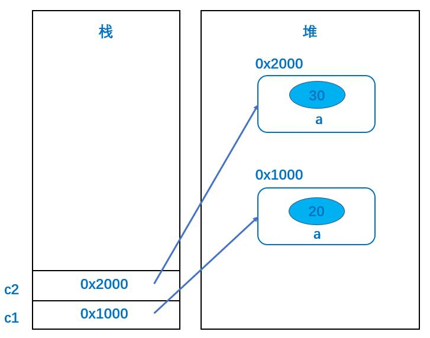
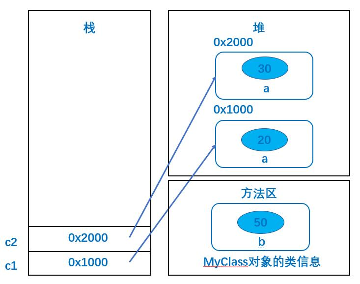

## 一、`abstract`

### 1.1、什么是抽象

> 似是而非的，像却又不是；具有某种特征，但不完整。


> 现实世界中，都是**动物**的子对象，而没有动物对象。


```java
public class Animal {
 	private String variety;//品种
    private int age;//年龄
    private String gender;//性别
	
    //get和set

    public void eat() {
        System.out.println("eat...");
    }
    
	public void sleep() {
        System.out.println("sleep...");
    }    
}
```

> `Animal`仅是一种会吃会睡的对象，再无其他行为，不够具体，不够完整。
>
> 程序是用来模拟现实世界，解决实际问题的，现实世界中存在的都是动物具体的子类对象，并不存在动物对象，所以，`Animal`不应该被独立创建成对象。
>
> 如何限制这种对象的创建？

### 1.2、抽象类

> `abstract`修饰类，此类不能`new`对象。
>
> 被`abstract`修饰的类，称为**抽象类**。
>
> 抽象类意为不够完整的类、不够具体的类，抽象类对象无法独立存在，即**不能new对象**。

```java
public abstract class Animal {
 	private String variety;//品种
    private int age;//年龄
    private String gender;//性别
	
    //get和set

    public void eat() {
        System.out.println("eat...");
    }
    
	public void sleep() {
        System.out.println("sleep...");
    }    
}
```

> 作用：
>
> * 可被子类继承，提供共性属性和方法；
> * 可声明为引用，更自然的使用多态。
>
> 经验：
>
> * 抽象父类，可作为子类的组成部分，依附于子类对象存在，由**父类共性+子类独有**组成完整的子类对象。

### 1.3、抽象方法

```java
public abstract class Animal {
 	private String variety;//品种
    private int age;//年龄
    private String gender;//性别
	
    //get和set

    public void eat() {
        System.out.println("eat...");
    }
    
	public void sleep() {
        System.out.println("sleep...");
    }    
}
```

> `Dog`中的`eat()`应输出**狗在吃骨头**；
>
> `Cat`中的`eat()`应输出**猫在吃鱼**。
>
> 父类提供的方法很难满足子类不同需求，如不定义，则表示所有动物都不会吃、睡。如果定义，略显多余，多数会被子类覆盖。
>
> 类似这种有必要声明，而没必要实现的方法，可以定义为**抽象方法**。

```java
public abstract class Animal {
 	private String variety;//品种
    private int age;//年龄
    private String gender;//性别
	
    //get和set

    public abstract void eat();
	public abstract void sleep();
}
```

> 被`abstract`修饰的方法，称为**抽象方法**。
>
> 抽象方法**只有方法声明，没有方法实现**。意为不完整的方法，必须包含在抽象类中(有抽象方法的类一定是抽象类)。
>
> 产生继承关系后，**子类必须重写父类中所有的抽象方法，否则子类还是抽象类**。

### 1.4、总结

> `abstract`修饰是类是抽象类，不能`new`对象，可以被继承，也可以声明引用；
>
> `abstract`修饰方法是抽象方法，只有方法声明，没有方法体，包含在抽象类中；
>
> 抽象类不一定有抽象方法，有抽象方法的类一定是抽象类；
>
> 子类继承抽象类后，必须重写父类中所有的抽象方法，否则子类还是抽象类。
>
> 抽象类可以定义静态方法

## 二、`static`

### 2.1、什么是静态

> `static(静态)`可以修饰属性和方法。
>
> 被`static`修饰的属性称为静态属性(类属性)，被`static`修饰的方法称为静态方法(类方法)。
>
> 静态成员是全类所有对象共享的成员，在**全类中只有一份**，不因创建多个对象而产生多份。
>
> 不需要创建对象，可直接通过类名访问，访问方式如下：
>
> * `类名.成员`
> * `对象名.成员`

### 2.2、静态属性

```java
public class MyClass {
    public int a; //实例属性
}

public class MyTest1 {
    public static void main(String[] args) {
        MyClass c1 = new MyClass();
        c1.a = 20;
        MyClass c2 = new MyClass();
        c2.a = 30;

        System.out.println("c1.a = " + c1.a);
        System.out.println("c2.a = " + c2.a);
    }
}
```



> 实例属性是每个对象各自持有的独立空间，对象单方面修改，不会影响其他对象。

```java
public class MyClass {
    public int a;//实例属性
    public static int b;//静态属性
}

public class MyTest2 {
    public static void main(String[] args) {
        //static修饰的变量随着类的加载而存在，和是否创建对象无关。
        MyClass.b = 10;
        System.out.println(MyClass.b);
        System.out.println("==========================");
        MyClass c1 = new MyClass();
        MyClass c2 = new MyClass();
        System.out.println("c1.b = " + c1.b);
        System.out.println("c2.b = " + c2.b);
        System.out.println("==========================");
        c1.b = 1000;
        System.out.println("c1.b = " + c1.b);
        System.out.println("c2.b = " + c2.b);
    }
}
```



> 静态属性是整个类共同持有的共享空间(只有一份)，任何对象修改静态属性，都会影响其他对象对该属性的访问。
>
> `static`修饰的变量随着类的加载而存在，和是否创建对象无关。

### 2.3、静态方法

```java
public class MyClass {
    public int a;
    public static int b;

    //由static修饰的静态方法
    public static void m1() {
        //在本类中,可以通过"静态方法名"访问
        m2();
        System.out.println("m1....");
    }

    //由static修饰的静态方法
    public static void m2() {
        System.out.println("m2....");
    }
}

public class MyTest2 {
    public static void main(String[] args) {
        //在其他类中,可以通过"类名.静态方法名"的方式访问静态方法
        MyClass.m1();
    }
}
```

> 已知的静态方法：
>
> * `System.exit()`
> * `Arrays.copyOf()`
>
> 关于静态的注意事项：
>
> * 静态方法允许值访问静态成员；
> * 静态方法不能直接访问非静态成员；
> * 静态方法中不允许使用`this`或是`super`关键字。

### 2.4、动态代码块和静态代码块

#### 2.4.1、动态代码块

> 定义在类中，与属性和方法处于同一级。
>
> 语法：
>
> ```java
> class 类名 {
>     {
>     	//动态代码块
>     }
> }
> ```
>
> **创建对象时，触发动态代码块的执行（创建一次，执行一次）。**
>
> **执行时机**：
>
> * 动态代码块和实例属性的初始化顺序，由在类中书写的顺序决定；
>
> * 代码块和属性的初始化先于构造方法执行。
>
> **作用**：可为实例属性赋值，或必要的初始行为。

```java
public class X {
    public X() {
        System.out.println("实例属性");
    }
}

public class MyClass1 {
    private X x = new X();

    //动态代码块
    {
        System.out.println("动态代码块");
    }

    public MyClass1() {
        System.out.println("构造方法...");
    }
}

public class MyTest3 {
    public static void main(String[] args) {
        MyClass1 c1 = new MyClass1();
        System.out.println("-------------------------");
        MyClass1 c2 = new MyClass1();
    }
}
```

> 执行结果

```
实例属性
动态代码块
构造方法...
-------------------------
实例属性
动态代码块
构造方法...
```

#### 2.4.2、类加载

> `JVM`首次使用某个类时，查找到该类的`.class`文件，将`.class`文件中对类的描述信息（如：包名、类名、父类、属性、方法、构造方法）加载到内存中，进行保存。
>
> 类加载时机：
>
> * 创建对象；
> * 创建子类对象；
> * 访问静态属性；
> * 调用静态方法；
> * 主动加载：`Class.forName("全类名")`

#### 2.4.3、静态代码块

> 定义在类中，与属性和方法处于同一级。
>
> 语法：
>
> ```java
> class 类名 {
>  static {
>      //静态代码块
>  }
> }
> ```
>
> **类加载**时，触发静态代码块的执行（**仅一次**）。
>
> **执行时机**：
>
> * 静态代码块和静态属性的初始化顺序，由在类中书写的顺序决定；
> * 代码块和属性的初始化先于构造方法执行。
>
> **作用**：可为静态属性赋值，或必要的初始行为。

```java
public class Y {
    public Y() {
        System.out.println("静态属性");
    }
}

public class MyClass2 {
    private static Y y = new Y();

    //静态代码块
    static {
        System.out.println("静态代码块");
    }


    public MyClass2() {
        System.out.println("构造方法...");
    }
}

public class MyTest4 {
    public static void main(String[] args) {
        MyClass2 c1 = new MyClass2();
        System.out.println("+++++++++++++++++++++++++++");
        MyClass2 c2 = new MyClass2();
    }
}
```

> 执行结果

```
静态属性
静态代码块
构造方法...
+++++++++++++++++++++++++++
构造方法...
```

#### 2.4.4、对象创建过程

```java
public class X {
    public X() {
        System.out.println("实例属性");
    }
}

public class Y {
    public Y() {
        System.out.println("静态属性");
    }
}

public class MyClass3 {
    private X x = new X();
    private static Y y = new Y();

    //动态代码块
    {
        System.out.println("动态代码块");
    }

    //静态代码块
    static {
        System.out.println("静态代码块");
    }
    
    public MyClass3() {
        System.out.println("构造方法...");
    }
}


public class MyTest5 {
    public static void main(String[] args) {
        MyClass3 c1 = new MyClass3();
        System.out.println("==========================");
        MyClass3 c2 = new MyClass3();
    }
}

```

> 执行结果

```
静态属性
静态代码块
实例属性
动态代码块
构造方法...
==========================
实例属性
动态代码块
构造方法...
```

> **注意**：代码块和属性的执行顺序和在类中定义的顺序有关。

#### 2.4.5、带有继承的对象创建过程

```java
public class X {
    public X() {
        System.out.println("父类实例属性");
    }
}

public class Y {
    public Y() {
        System.out.println("父类静态属性");
    }
}

public class M {
    public M() {
        System.out.println("子类实例属性");
    }
}

public class N {
    public N() {
        System.out.println("子类静态属性");
    }
}

public class SuperClass {
    private X x = new X();
    private static Y y = new Y();

    //动态代码块
    {
        System.out.println("父类动态代码块");
    }

    //静态代码块
    static {
        System.out.println("父类静态代码块");
    }
    
    public SuperClass() {
        System.out.println("父类构造方法...");
    }
}

public class SubClass extends SuperClass {
    private M m = new M();
    private static N n = new N();

    //动态代码块
    {
        System.out.println("子类动态代码块");
    }

    //静态代码块
    static {
        System.out.println("子类静态代码块");
    }
    
    public SubClass() {
        System.out.println("子类构造方法...");
    }
}

public class MyTest6 {
    public static void main(String[] args) {
        SubClass subClass = new SubClass();
        System.out.println("***************************");
        SubClass subClass1 = new SubClass();
    }
}
```

> 执行结果

```
父类静态属性
父类静态代码块
子类静态属性
子类静态代码块
父类实例属性
父类动态代码块
父类构造方法...
子类实例属性
子类动态代码块
子类构造方法...
***************************
父类实例属性
父类动态代码块
父类构造方法...
子类实例属性
子类动态代码块
子类构造方法...
```

> **注意**：代码块和属性的执行顺序和在类中定义的顺序有关。

### 2.5、单例设计模式

> 是什么：一个类的对象的实例只有一个，例如：`Sun`、`God`
>
> 如何设计：
>
> * 如果我们要让类在一个虚拟机中只能产生一个对象，我们首先必须将类的构造方法的访问权限设置为`private`；
> * 不能用`new`操作符在类的外部直接产生类的对象；
> * 调用该类的某个静态方法(pubic)以返回类内部创建的对象；
> * 静态方法只能访问类中的静态成员变量，所以，指向类内部产生的该类对象的变量也必须定义成静态的。

```java
//饿汉式
public class SingleObject1 {
	private static SingleObject1 obj = new SingleObject1();
	
	private SingleObject1() {
		
	}
	
	public static SingleObject1 getInstance() {
		return obj;
	}
}

//懒汉式
public class SingleObject2 {
	private static SingleObject2 obj = null;
	
	private SingleObject2() {
		
	}
	
	public static SingleObject2 getInstance() {
		if(obj == null) {
			obj = new SingleObject2();
		}
		return obj;
	}
}

//测试
public class MyTestSingle {

	public static void main(String[] args) {
		/*
		 * 获取通过单例模式创建的对象
		 * */
		SingleObject1 s1 = SingleObject1.getInstance();
		SingleObject1 s2 = SingleObject1.getInstance();
		
		/*
		 * 验证两个引用是否指向同一个对象
		 * */
		System.out.println(s1 == s2);
		
		
		SingleObject2 s3 = SingleObject2.getInstance();
		SingleObject2 s4 = SingleObject2.getInstance();
		System.out.println(s3 == s4);
	}
}
```

## 三、`final`

> `final`：最终的，最终的，最后的，决定性的，不可改变的。
>
> `final`可以修饰：
>
> * 变量
> * 方法
> * 类
>
> `final`修饰的类，不能被继承
>
> * `String`、`Math`、`System`都被`final`修饰，不能被继承。
>
> `final`修饰的方法，不能被重写(覆盖)
>
> `final`修改的变量，是常量，不能修改值
>
> * 所有`final`修改的变量只能赋值一次，值不允许改变。

### 3.1、关于`final`修饰变量

> 实例常量不再提供默认值，必须手动赋予初始值；
>
> 赋值时机：显式初始化，动态代码块，构造方法。

```java
public class MyClass {
    private final int X = 10;

    {
        //this.x = 10;
    }

    public MyClass() {
        //this.x = 100;
    }
}
```

> 静态常量不再提供默认值，必须手动赋予初始值；
>
> 赋值时机：显式初始化，静态代码块。

```java
public class MyClass1 {
    private static final int X = 10;

    static  {
        //x = 10;
    }
}
```

> `final`修饰引用类型，地址不可变。

```java
public class Student {
    int x = 10;
}

 class MyTest {
    public static void main(String[] args) {
        final int NUM = 100;
        //NUM += 100; //错误

        final Student s1 = new Student();
        s1.x = 1000; //final修饰的对象，对象本身的内容可以修改。

        //s1 = new Student(); //错误
    }
}
```


