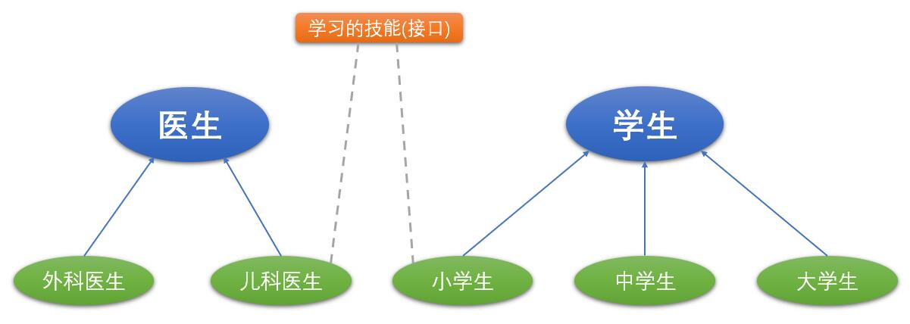

## 一、概述

> 有时必须从几个类中派生出一个子类，继承它们所有的属性和方法。但是，Java不支持多重继承。有了接口，就可以得到**多重继承**的效果。
>
> 有时必须从几个类中抽取出一些共同的行为特征，而它们之间又没有`is a`的关系，仅仅是具有相同的行为特征而已。例如：鼠标、键盘、打印机、扫描仪、摄像头、充电器、MP3机、手机、数码相机、移动硬盘等都支持USB连接。我们可以将这些共同的特征定义为接口。
>
> **接口就是规范，定义的是一组规则**，体现了现实世界中`如果你是/要...则必须能...`的思想。继承是一个`是不是`的关系，而接口实现则是`能不能`的关系。
>
> **接口的本质是契约，标准，规范**，就像我们的法律一样。制定好后大家都要遵守。
>
> 接口举例：



## 二、接口的使用

### 2.1、定义接口

> 接口(interface)是抽象方法和常量值定义的集合。
>
> 接口特点：
>
> * 用`interface`来定义；
> * 接口中的所有**成员变量**都默认是由`public static final`修饰的；
> * 接口中的所有**抽象方法**都默认是由`public abstract`修饰的；
> * 接口中没有构造器；
> * 接口可以继承接口，并且支持多继承。
>
> ```java
> //定义接口
> public interface 接口名 {
>     //常量
>     //抽象方法
> }
> 
> //定义接口，可以继承其他多个接口
> public interface 接口名 extends 父接口名1, 父接口名2, 父接口名3... {
>     //常量
>     //抽象方法
> }
> ```
>
> 案例：

```java
//交通工具接口
public interface Vehicle {
	//启动
	void start();
	//停止
	void stop();
	//运行
 	void run();
}

//能源接口
public interface Energy {
	//加油
	void addOil();
}
```

### 2.2、实现接口

> 在Java中继承类使用关键字`extends`，实现接口使用关键字`implements`。一个类可以实现多个接口。
>
> 实现接口的类中必须实现接口中的所有抽象方法，方可实例化。否则，这个类仍要定义为抽象类。
>
> 接口的主要用途就是被实现类实现。
>
> 接口和类是并列关系，或者**可以理解为一种特殊的类**。
>
> 从本质上讲，接口是一种特殊的抽象类，这种抽象类中只包含常量和方法的定义(`JDK7.0及之前`)，而没有变量和方法的实现。
>
> ```java
> //实现一个接口
> public class 类名 implements 接口1 {
>  //属性
>  //构造方法
>  //方法
> }
> 
> //实现多个接口
> public class 类名 implements 接口1, 接口2... {
>  //属性
>  //构造方法
>  //方法
> }
> ```
>
> 案例：

```java
//定义飞机类，实现Vehicle和Energy接口
public class Plane implements Vehicle, Energy {
	@Override
	public void start() {
		System.out.println("飞机启动");
	}

	@Override
	public void stop() {
		System.out.println("飞机停止");
	}

	@Override
	public void run() {
		System.out.println("飞机运行");
	}

	@Override
	public void addOil() {
		System.out.println("飞机加油");
	}
}

//定义汽车类，实现Vehicle和Energy接口
public class Car implements Vehicle, Energy {
	@Override
	public void start() {
		System.out.println("汽车启动");
	}

	@Override
	public void stop() {
		System.out.println("汽车停止");
	}

	@Override
	public void run() {
		System.out.println("汽车运行");
	}

	@Override
	public void addOil() {
		System.out.println("汽车加油");
	}
}

public class MyTest1 {
    public static void main(String[] args) {
        Plane plane = new Plane();
        plane.addOil();
        plane.start();
        plane.run();
        plane.stop();
        System.out.println("--------------------------");

        Car car = new Car();
        car.addOil();
        car.start();
        car.run();
        car.stop();
    }
}
```

> 运行结果：

```
飞机加油
飞机启动
飞机运行
飞机停止
--------------------------
汽车加油
汽车启动
汽车运行
汽车停止

Process finished with exit code 0

```

> 如果定义类，既要实现接口，又要继承父类，那么要先写`extends`，后写`implements`。
>
> ```java
> //实现多个接口
> public 类名 extends 父类 implements 接口1, 接口2... {
>  //属性
>  //构造方法
>  //方法
> }
> ```
>
> 案例：

```java
//飞机类
public abstract class Plane {
    private int height; //高度
    private int length; //长度
    private int wingSpan; //翼展
    private int emptyWeight; //空重
    private int weight; //载重
   	private int speed; //最大速度
    private int numOfPilots; //飞行员数量
    
    //get/set
}

//交通工具接口
public interface Vehicle {
	//启动
	void start();
	//停止
	void stop();
	//运行
 	void run();
}

//能源接口
public interface Energy {
	//加油
	void addOil();
}

//战斗机类 - 继承父类，实现接口
public class Fighter extends Plane implements Vehicle, Energy {
    @Override
	public void start() {
		System.out.println("战斗机启动");
	}

	@Override
	public void stop() {
		System.out.println("战斗机停止");
	}

	@Override
	public void run() {
		System.out.println("战斗机运行");
	}

	@Override
	public void addOil() {
		System.out.println("战斗机加油");
	}
}

public class MyTest2 {
    public static void main(String[] args) {
        Fighter fighter = new Fighter();
        fighter.addOil();
        fighter.start();
        fighter.run();
        fighter.stop();
    }
}
```

> 执行结果：

```
战斗机加油
战斗机启动
战斗机运行
战斗机停止
```

### 2.3、抽象类和接口对比

接口特点：

1. 用`interface`来定义；
2. 接口中没有构造器；
3. 接口中的所有**成员变量**都默认是由`public static final`修饰的（常量）；
4. 接口中的所有**抽象方法**都默认是由`public abstract`修饰的（抽象方法）；
5. 接口可以继承接口，并且支持多继承。

抽象类特点：

1. `abstract`修饰是类是抽象类；
2. 不能`new`对象（抽象类不完整，无法描绘出准确的对象）；
3. 可以被继承，也可以声明引用；
4. 抽象类不一定有抽象方法，有抽象方法的类一定是抽象类；`abstract`修饰方法是抽象方法，只有方法声明，没有方法体，包含在抽象类中。
5. 子类继承抽象类后，必须重写父类中所有的抽象方法，否则子类还是抽象类。

6. 抽象类可以定义静态方法
7. 抽象类可以包含初始化块

> 相同点：
>
> 1. 接口和抽象类都不能被实例化，只能被其他类实现和继承；
> 2. 接口和抽象类都可以包含抽象方法，实现接口和抽象类的类都必须实现这些抽象方法，否则实现的类就是抽象类。
>
> 不同点：
>
> 1. 抽象类与接口定义不同：抽象类`abstract class` ，接口`interface`
> 2. 接口里只能包含抽象方法，不包含已经实现的方法(JDK7.0及之前)，抽象类则完全可以包含普通的方法；
> 3. 接口里只能定义静态常量属性，不能定义普通属性，抽象类里既可以定义普通属性，也可以定义静态常量；
> 4. 接口不包含构造函数，抽象类可以包含构造函数，抽象类里的构造函数并不是用于创建对象，而是让其子类调用这些构造函数来完成属于抽象类的初始化操作；
> 5. 一个类最多只能有一个直接父类，包括抽象类，但一个类可以直接实现多个接口，通过实现多个接口可以弥补Java的单继承不足。
> 6. 接口里不能定义静态方法(JDK7.0及之前)，抽象类可以定义静态方法；
> 7. 接口不包含初始化块，但抽象类可以包含初始化块；

## 三、`Java 8`中关于接口的改进

> `Java 8`中，你可以为接口添加**静态方法**和**默认方法**。从技术角度来说，这是完全合法的，只是它看起来违反了接口作为一个抽象定义的理念。
>
> **静态方法**：使用`static`关键字修饰。可以通过接口直接调用静态方法，并执行其方法体。
>
> **默认方法**：默认方法使用`default`关键字修饰。**可以通过实现类对象来调用**。我们在**已有的接口中提供新方法的同时，还保持了与旧版本代码的兼容性**。比如：`Java 8 API`中对`Collection`、`List`、`Comparator`等接口提供了丰富的默认方法。

```java
public interface A {
    double PI = 3.14; //常量
    default void m1() {
        System.out.println("test1...");
    }
    
    public static void m2() {
        System.out.println("test2...");
    }
}

public class MyClass implements A {

}

public class MyTest3 {
    public static void main(String[] args) {
        MyClass myClass = new MyClass();
        myClass.m1(); //通过实现类对象来调用
        A.m2(); //调用接口中的静态方法
    }
}
```

> 若一个接口中定义了一个默认方法，而另外一个接口中也定义了一个同名同参数的方法（不管此方法是否是默认方法），在实现类同时实现了这两个接口时，会出现**接口冲突**。
>
> **解决办法**：实现类必须覆盖接口中同名同参数的方法，来解决冲突。

```java
public interface M {
    default void test() {
        System.out.println("M....");
    }
}

public interface N {
    default void test() {
        System.out.println("N....");
    }
}

public class MyClass1 implements M, N {
    //实现类必须覆盖接口中同名同参数的方法，来解决冲突
    @Override
    public void test() {
        M.super.test();
        N.super.test();
        System.out.println("MyClass1....");
    }
}

public class MyTest4 {
    public static void main(String[] args) {
        MyClass1 myClass1 = new MyClass1();
        myClass1.test();
    }
}
```

> 若一个接口中定义了一个默认方法，而父类中也定义了一个同名同参数的非抽象方法，则不会出现冲突问题。因为此时遵守：类优先原则。接口中具有相同名称和参数的默认方法会被忽略。

```java
public class SuperClass {
    public void test() {
        System.out.println("SuperClass....");
    }
}

public class MyClass2 extends SuperClass implements M, N {

}

public class MyTest5 {
    public static void main(String[] args) {
        MyClass2 myClass2 = new MyClass2();
        myClass2.test();
    }
}
```

## 四、内部类(了解)

### 4.1、概述

> 概念：在一个类内部定义的完整的类。
>
> 当一个事物的内部，还有一个部分需要一个完整的结构进行描述，而这个内部的完整的结构又只为外部事物提供服务，那么整个内部的完整结构最好使用内部类。
>
> 在Java中，允许一个类的定义位于另一个类的内部，前者称为**内部类**，后者称为**外部类**。
>
> 一般用在定义它的类或语句块之内，在外部引用它时必须给出完整的名称。
>
> 分类：
>
> * 成员内部类(`static`成员内部类和非`static`成员内部类)
> * 局部内部类

### 4.2、成员内部类

> 两个角色：
>
> * 作为类的角色：
>
>   * 可以在内部定义属性、方法、构造器等结构；
>
>   * 可以声明为`abstract`类 ，因此可以被其它的内部类继承；
>
>   * 可以声明为`final`的；
>
>   * 编译以后生成`OuterClass$InnerClass.class`字节码文件（也适用于局部内部类）
>
> * 作为类的成员的角色：
>   * 和外部类不同，内部类还可以声明为`private`或`protected`；
>   * 可以调用外部类的结构；
>   * 内部类可以声明为`static`的，但此时就不能再使用外层类的非`static`的成员变量；

```java
public class Outer {
    private String name = "outer";
    private int age;

    public class Inner {
        private String name = "inner";
        public void display(String name) {
            System.out.println(name);
            System.out.println(this.name);
            //访问外部类的属性
            System.out.println(Outer.this.name);
            System.out.println("这是内部类的方法");
        }
    }

    public void test() {
        //创建内部类对象
        Inner brain = new Inner();
        brain.display("test");
        System.out.println("这是外部类的方法");
    }
}

public class MyTest6 {
    public static void main(String[] args) {
        //创建外部类对象
        Outer outer = new Outer();
        outer.test();
        
      	Outer.Inner inner = outer.new Inner();
        inner.display("aaa");
    }
}
```

### 4.3、局部内部类

> 定义在方法内或代码块内
>
> ```java
> class Outer {
>     方法() {
>         class 局部内部类 {
>             
>         }
>     }
>     
>     {
>         class 局部内部类 {
>             
>         }
>     }
> }
> ```
>
> 案例：

```java
public class Outer1 {
    public Comparable test1() {
        class MyComparable implements Comparable {
            @Override
            public int compareTo(Object o) {
                return 0;
            }
        }

        MyComparable comparable = new MyComparable();
        return comparable;
    }

    public Comparable test2() {
        Comparable comparable = new Comparable() {
            @Override
            public int compareTo(Object o) {
                return 0;
            }
        };

        return comparable;
    }
}
```

## 五、包

> `包(package)`是Java提供的一种区别类的名字空间的机制，是类的组织方式，是一组相关类和接口的集合，它提供了访问权限和命名的管理机制。

### 5.1、包的应用

#### 5.1.1、声明包

> 在源文件的开始：`package 包名;`
>
> 目的：告诉编译器，当前类所属的包。
>
> 在IDEA声明包的两种方式：
>
> * 通过创建`package`就表示声明包，然后在包下创建类；
> * 创建类的同时指定`package`。
>
> 关于包的理解：
>
> * 包的本质就是文件夹目录结构，功能相似的类放在同一目录下；
> * 对类进行了包装，在不同的包中允许有相同类名存在，在一定程度上可以避免命名冲突。

#### 5.1.2、使用包

> 如果当前类要用到其他包中的类，需要使用`import`关键字来导入
>
> * 例如：`import  java.util.Scanner;`
>
> 如果需要用到某个包的多个类可以用`*`代替所有类
>
> * 例如：`import java.util.*;`

### 5.2、JDK常用包介绍

>`java.lang`：包括了Java语言程序设计的基础类；
>
>`java.util`：包含集合、日期和各种实用工具类；
>
>`java.io`：包含可提供数据输入、输出相关功能的类；
>
>`java.net`：提供用于实现Java网络编程的相关功能类；
>
>`java.sql`：提供数据库操作相关功能类。
>
>注意：`java.lang`是默认会导入的包，不需要手动导入。


