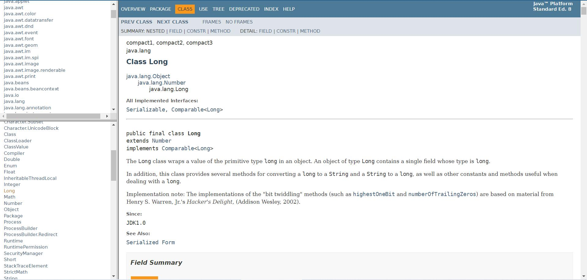

## 一、什么是API

> 定义：`Application Programming Interface`，`API`是应用程序编程接口，指一些预先定义好的类。

### 1.1、`Java API`

> `Java API`就是Oracle公司提供给我们使用的类，这些类将底层的实现封装了起来，我们不需要关心这些类是如何实现的，**只需要学习这些类如何使用**。
>
> 主要内容：类层次结构、类及其一般目的的说明、成员变量表、构造函数表、方法表、变量详细说明表及每一个变量使用目的的详细描述、构造方法的详细说明及进一步的描述等等。



> 如何使用:
>
> * 左上是所有的包；
> * 当在软件包中选择一个包时，左下会显示这个软件包中所有的类和接口；
> * 点击相应的类和接口，右侧会有相应的类和接口的详细信息。
>
> 如何学习：
>
> * 不需要全部学习，用到时再学习，**但是需要先掌握一些常用的，不同的领域有不同的API**，没有人熟悉所有的API，对一般人而言只是熟悉工作中要用到的API；
> * 某一领域知识+案例，很容易掌握API；
> * 字典：现用现查。

### 1.2、Java常用类库简介

> Java程序设计就是定义类的过程，定义的类分为两大类：
>
> * 系统定义的类：即Java类库中的类。这部分类是已经设计好的，直接用就可以。也是我们这里所指的Java类库中的主要内容；
> * 用户程序自定义的类：需要开发人员自己设计实现。
>
> 重要的包及其类：
>
> * `java.lang`：包括了Java语言程序设计的基础类；
> * `java.util`：包含集合、日期和各种实用工具类；
> * `java.io`：包含可提供数据输入、输出相关功能的类；
> * `java.net`：提供用于实现Java网络编程的相关功能类；
> * `java.sql`：提供数据库操作相关功能类。
>
> 注意：`java.lang`是默认会导入的包，不需要手动导入。

## 二、`Object`类

### 2.1、简介

> `Object`类是所有类的直接或间接父类，位于继承树的最顶层。
>
> 任何类，如果没有明确书写`extends`继承某个类，都默认直接继承`Object`类，否则为间接继承。
>
> `Object`类中所定义的方法，是所有对象都具备的方法。
>
> `Object`类型可以存储任何对象
>
> * 作为参数，可接收任何对象；
> * 作为返回值，可返回任何对象。

### 2.2、常用方法

#### 2.2.1、`toString`方法

> 方法定义：`public String toString()`
>
> 返回一个对象的字符串表示形式；
>
> 当打印引用，如调用`System.out.println()`时，会自动调用对象的`toString()`方法，打印出引用所指的对象的`toString()`方法的返回值；
>
> 每个类都直接或间接地继承自`Object`，因此每个类都有`toString()`方法；
>
> 可以根据程序要求重写该方法。

```java
/*
 * 表示Person的类
 * */
public class Person {
	private String name;
	private int age;
	private String gender;
    
    //set/get

    //Object类中的toString方法不能满足要求，重写toString
	@Override
	public String toString() {
		return "Person [name=" + name + ", age=" + age + ", gender=" + gender + "]";
	}
}

public class MyTest1 {
	public static void main(String[] args) {
		Person p1 = new Person();
		p1.setName("ZhangSan");
		p1.setAge(10);
		p1.setGender("男");
		
		System.out.println(p1);
		System.out.println(p1.toString());
    }
}
```

#### 2.2.2、`equals`方法

> 学习`equals`方法之前，有必要回顾一些`==`运算符。
>
> `==`作用：
>
> * 判断基本数据类型值是否相同；
> * 判断两个引用是否指向同一个对象（判断两个对象的地址是否相同）

```java
public class MyTest2 {
	public static void main(String[] args) {
        int a = 100;
        int b = 20;
        //判断基本数据类型
        System.out.println(a == b);
        
		Person p1 = new Person();
        Person p2 = new Person();
        //判断两个引用是否指向同一个对象
        System.out.println(p1 == p2);
        p2 = p1;
        System.out.println(p1 == p2);
    }
}
```

> 方法定义：`public boolean equals(Object obj)`
>
> 对于`Object`类的`equals()`方法来说，它判断调用`equals()`方法的引用（方法调用者）与传进来的引用（方法参数）是否一致，即这两个引用是否指向的是同一个对象，`Object`类中的`equals()`方法等价于`==`。

```java
public class MyTest2 {
	public static void main(String[] args) {
        int a = 100;
        int b = 20;
        //判断基本数据类型
        System.out.println(a == b);
        
		Person p1 = new Person();
        Person p2 = new Person();
        //判断两个引用是否指向同一个对象
        System.out.println(p1 == p2);
        //equals()等价于==
        System.out.println(p1.equals(p2));
        p2 = p1;
        System.out.println(p1.equals(p2));
    }
}
```

> 多数时候，我们希望判断两个相同类型对象的每个属性的值是的相同（**值**是否相同，内容是否相同），此时从`Object`中继承的`equals()`方法无法满足我们的需求，我们需要在自定义类中重写该方法（参考`String`类相关源码）。
>
> 修改`Person`类

```java
/*
 * 表示Person的类
 * */
public class Person {
	private String name;
	private int age;
	private String gender;
    
    //set/get
    
    @Override
    public boolean equals(Object o) {
        if (this == o) return true;
        if (!(o instanceof Person)) return false;
        Person person = (Person) o;
        return age == person.age && Objects.equals(name, person.name) && Objects.equals(gender, person.gender);
    }

    //Object类中的toString方法不能满足要求，重写toString
	@Override
	public String toString() {
		return "Person [name=" + name + ", age=" + age + ", gender=" + gender + "]";
	}
}
```

#### 2.2.3、`hashCode`方法

> 方法定义：`public int hashCode()`
>
> 这个方法返回对象的十进制的哈希值。哈希值是通过哈希算法**根据对象的地址**计算出来的int类型的数组。
>
> `Object`类的`hashCode()`方法为不同的对象返回不同的值，`Object`类的`hashCode`值我们可以认为其表示对象的地址。
>
> 如果`equals()`判断两个对象相等，那么它们的`hashCode()`方法应该返回同样的值。

## 三、包装类

### 3.1、目前存在的问题及包装类简介

```java
public void test(Object obj) {
    
}
```

> 如果一个类中有上述方法，利用多态性，我们可以传入任意类的对象，但是不能传入基本数据类型数据。为了能让`test`方法传入基本数据类型数据，需要再定义8个重载的方法用来兼容8种基本数据类型。

```java
public void test(int obj) {
    
}

public void test(byte obj) {
    
}

...
```

> 如果每次碰到这种场景，都要额外写8个重载的方法，会让代码变得臃肿。此时，**我们需要一种可以将基本数据类型数据当成对象使用的技术。**
>
> Java提供了8个基本数据类型的包装类，将基本数据类型包装成相应的对象，并定义许多实用的方法供这些对象调用用来解决基本数据类型数据不能被当成对象使用的问题。
>
> 这8个类统称为包装器（Wrapper）类，而且都在`java.lang`包中，所以不需要`import`就可以直接使用。
>
> 8种基本数据类型和其包装类对应关系如下：
>
> * `byte -- Byte`
> * `short -- Short`
> * `int -- Integer`
> * `long -- Long`
> * `float -- Float`
> * `double -- Double`
> * `char -- Character`
> * `boolean -- Boolean`
>
> 除了`Integer`和`Character`类，其它六个类的类名和基本数据类型一致，只是类名的第一个字母大写即可。 

### 3.2、装箱和拆箱

> 装箱：基本数据类型转换成包装类；
>
> 拆箱：包装类转换成基本数据类型。
>
> 手动拆装箱

```java
/*
 * 手动装箱
 * 	基本数据类型--->包装类
 * */
int a = 10;
Integer i  = Integer.valueOf(a);
System.out.println(i);
/*
 * 手动拆箱
 * 	包装类--->基本数据类型
 * */
int b = i.intValue();
System.out.println(b);
```

> JDK自从1.5(5.0)版本以后，就引入了自动拆装箱的语法，也就是在进行基本数据类型和对应的包装类转换时，系统将自动进行，这将大大方便程序员的代码书写。

```java
/*
 * 自动装箱 JDK1.5
 * */
int a = 10;
Integer i1 = a;
/*
 * 自动拆箱 JDK1.5
 * */
int c = i1;
```

### 3.3、基本数据类型和字符串转换

```java
/*
 * 基本数据类型和字符串转换
 * 	基本数据类型--->字符串
 * 		int x = 10;  "10"
 * 		x + "";
 * 	字符串--->基本数据类型
 * 		String str = "10";
 * */
int x = 10;
String s = x + "";

/*
 * 字符串--->基本数据类型
 * String--->int
 * */
String str = "100";
x = Integer.parseInt(str);
System.out.println(x);
```

## 四、`String`类

> Java程序可以方便的处理字符串类型的数据信息，而这都要归功于Java中`String`类提供的强大功能。
> `String`类描述的是文本字符串序列，即多个字符组成的一串数据。
> `String`类代表字符串。Java 程序中的所有字符串字面值（如 `"abc"` ）都作为此类的实例实现
>
> **字符串是不可变的。一个字符串对象一旦被配置，其内容是不可变的。**

### 4.1、创建

> 常见创建方式：

```java
String str1 = "hello";
String str2 = new String("hello");
```

### 4.2、常用方法

#### 4.2.1、判断功能

> * `boolean equals(Object obj)`
> * `boolean equalsIgnoreCase(String str)` 
> * `boolean contains(String str)` 
> * `boolean startsWith(String str)` 
> * `boolean endsWith(String str) `
> *  `boolean isEmpty() `

```java
String str1 = new String("abcd");
/*
 * equals() 判断字符串的内容是否相等
 * */
System.out.println(str1.equals("abcd"));
//equalsIgnoreCase() 忽略大小写判断内容是否相等
System.out.println(str1.equalsIgnoreCase("ABCD"));
System.out.println(str1.contains("abc"));
//startsWith()
System.out.println(str1.startsWith("abc"));
System.out.println(str1.startsWith("bc"));
//endsWith()
System.out.println(str1.endsWith("bc"));
System.out.println(str1.endsWith("bcd"));
//isEmpty()
System.out.println(str1.isEmpty());
System.out.println("".isEmpty());
```

#### 4.2.2、获取功能

> * `int length()` 
> * `char charAt(int index)` 
> * `int indexOf(int ch)` 
> * `int indexOf(String str)`
> * `int indexOf(int ch, int fromIndex)` 
> * `int indexOf(String str, int fromIndex)`
> * `String substring(int start)`
> * `String substring(int start, int end)`

```java
//length()
System.out.println("abcde".length());
//charAt()
//System.out.println(str2.charAt(100));
//indexOf() 返回字符首次出现的索引,如果没有被判断的字符，返回-1
System.out.println("abcdabc".indexOf('e'));
//判断字符串首次出现的索引
System.out.println("abcdabc".indexOf("bcd"));
System.out.println("abcdabc".indexOf('c'));
System.out.println("abcdabc".indexOf('c', 3));
//获取字串
System.out.println("abcdabc".substring(5));
//获取字串，但是不包含end
System.out.println("abcdabc".substring(1, 2));
```

#### 4.2.3、转换功能

> * `byte[] getBytes()` 
> * `char[] toCharArray()`
> * `static String valueOf(char[] chs)` 
> * `static String valueOf(int i) `
> * `String toLowerCase() `
> * `String toUpperCase() `
> * `String concat(String str)`

```java
/*
 * 字符串的转换功能
 * */
String str = "hello";
//getBytes()转换成byte类型的数组
byte[] arr = str.getBytes();
System.out.println(Arrays.toString(arr));

//toCharArray()转换成char类型的数组
char[] arrChar = str.toCharArray();
System.out.println(Arrays.toString(arrChar));

//大小写转换
System.out.println(str.toUpperCase());
System.out.println("ABCD".toLowerCase());
/*
 * 字符串连接---生成了新的字符串
 * */
System.out.println(str.concat("****"));
System.out.println(str);
//基本数据类型--->字符串
System.out.println(String.valueOf(1000));
System.out.println(String.valueOf(100.56F));
```

#### 4.2.4、替换功能

> * `String replace(char old, char new)`
> * `String replace(String old, String new)`

```java
/*
 * 替换功能---生成了新的字符串
 * */
String str = "hello 123";
System.out.println(str.replace('l', '*'));
System.out.println(str);
System.out.println(str.replace("ll", "$"));
System.out.println(str);
```

#### 4.2.5、去空格功能

> * `trim()`

```java
/*
 * 去除空格的功能
 * trim()---去除字符串首尾的空格
 * */
String str1 = " ab c ";
System.out.println(str1.length());
String str2 = str1.trim();
System.out.println(str2);
System.out.println(str2.length());
```

#### 4.2.6、按字典比较

> * `int compareTo(String str)`
> * `int compareToIgnoreCase(String str)`

```java
System.out.println("a".compareTo("b"));
System.out.println("a".compareTo("a"));
System.out.println("b".compareTo("a"));
System.out.println("abc".compareTo("abd"));
System.out.println("abcd".compareTo("abdd"));
```

#### 4.2.7、案例

> 注册案例：对输入的用户名和密码进行格式验证
>
> * 去掉多余的空格
> * 不能为空
> * 用户名和密码不能超过16位

```java
import java.util.Scanner;

public class Regist {
	public static void main(String[] args) {
		/*
		 * 注册程序
		 * 对输入的用户名和密码进行校验
		 * 
		 * 1.去除多余空格
		 * 2.不能为空  > 0
		 * 3.长度小于等于16 
		 * */
		Scanner sc = new Scanner(System.in);
		
		System.out.print("请输入用户名:");
		String username = sc.next();
		
		if(!judge(username)) {
			System.out.println("用户名不能为空，长度不超过16位");
			return;
		}
		
		System.out.print("请输入密码:");
		String password = sc.next();
		if(!judge(password)) {
			System.out.println("密码不能为空，长度不超过16位");
			return;
		}
		//.....
		//.....
	}
	//内容校验
	public static boolean judge(String str) {
		//去掉多余空格
		String s = str.trim();
		//获取字符串长度
		int length = s.length();
		//判断字符串长度是否合法
		if(length > 0 && length <= 16) {
			return true;
		}
		return false;
	}
}
```

### 4.3、关于字符串不可变的理解

> 字符串都放在字符串常量池中，相同内容的字符串在常量池中只有一份。

```java
public class Test3 {
	public static void main(String[] args) {
		/*
		 * 字符串是不可变的
		 * 
		 * 内存
		 * 	栈
		 * 	堆
		 * 	静态区(字符串常量池)
		 * 
		 *	1.字符串都放在字符串常量池中
		 *	2.相同内容的字符串在常量池中只有一份
		 * 
		 * */
		String str1 = "多喝热水";
		String str2 = new String("多喝热水");
		String str3 = "多喝热水";
		
		System.out.println(str1 == str2);//false
		System.out.println(str1 == str3);//true
		
		//编译器进行优化，编译阶段就能计算出结果
		String str4 = "多喝" + "热水";//"多喝热水" str4 = "多喝热水"
		System.out.println(str1 == str4);//true
				
		String str5 = "多喝";
		String str6 = "热水";
        //只要其中有一个是变量，结果就在堆中
		String str7 = str5 + str6;
		String str8 = str5 + "热水";
		System.out.println(str1 == str7);//false
		System.out.println(str1 == str8);//false
		
		str1 = "abcd";
	}
}
```

### 4.4、可变字符串

> `StringBuffer`
>
> **优势**：解决了String用字符串做拼接，既费时又耗内存的问题。
>
> 字符串缓冲区，用于存储可变字符序列的容器。
>
> 特点
>
> * 可以对字符串进行修改
> * 长度可变

```java
public class Test4 {
	public static void main(String[] args) {
		/*
		 * StringBuffer---带缓冲区的字符串
		 * 可以对字符串进行动态的拼接
		 * 
		 * 如何创建
		 * */
		StringBuffer stb = new StringBuffer("abcd");
		/*
		 * 如何拼接
		 * */
		stb.append("***");
		stb.append("$$$$");
		/*
		 * 如何StringBuffer---->String
		 * toString()
		 * */
		String str = stb.toString();
		System.out.println(str);
	}
}
```

> `StringBuilder`
>
> * JDK1.5以后出现了功能和`StringBuffer`一模一样的类，就是`StringBuilder`
> * 和`StringBuffer`的区别
>   * `StringBuffer`是线程同步的。通常用于多线程。
>   * `StringBuilder`是线程不同步(不安全)的。通常用于单线程。它的出现提高了处理可变字符串对象的效率。

## 五、数学相关类

### 5.1、`Math`类

> **位置**：
>
> * `java.lang`包中
>
> **常量：**
>
> * `PI`圆周率
>
> **常用方法：**
>
> * `ramdom()`：返回带正号的 double 值，该值大于等于 0.0 且小于 1.0。

```java
System.out.println(Math.random());
System.out.println("===============================================");
//0~9
for(int i = 0; i < 10; i++) {
    System.out.println((int)(Math.random()*10));
}
System.out.println("===============================================");
//1~10
for(int i = 0; i < 10; i++) {
    System.out.println((int)(Math.random()*10) + 1);
}
//1~4
System.out.println("===============================================");
for(int i = 0; i < 10; i++) {
    System.out.println(((int)(Math.random()*10))%4 + 1);
}
```

### 5.2、`BigDecimal`类

> **位置**：
>
> * `java.lang`包中
>
> **作用：**精确计算浮点整数
>
> **常用方法：**
>
> * `add(BigDecimal augend)`加
> * `subtract(BigDecimal subtrahend)`减
> * `multiply(BigDecimal multiplicand)`乘
> * `divide(BigDecimal divisor)`除

```java
public class MyTest2 {
    public static void main(String[] args) {
        BigDecimal num1 = new BigDecimal(10);
        BigDecimal num2 = new BigDecimal(9.5);

        System.out.println(num1.add(num2));
        System.out.println(num1.subtract(num2));
        System.out.println(num1.multiply(num2));
        System.out.println(num1.divide(num2));
    }
}
```

> 进行除法运算时，如果不能准确的计算出结果时需要指定保留的位数和取舍方式。
>
> `divide(BigDecimal divisor, int scale, int roundingMode)`
>
> * `scale`：指定精确到小数点后几位
> * `mode`：指定小数部分的取舍模式，通常采用四舍五入的模式，取值为`BigDecimal.ROUND_HALF_UP`

```java
public class MyTest2 {
    public static void main(String[] args) {
        BigDecimal num1 = new BigDecimal(10);
        BigDecimal num2 = new BigDecimal(9.5);

        System.out.println(num1.add(num2));
        System.out.println(num1.subtract(num2));
        System.out.println(num1.multiply(num2));
        System.out.println(num1.divide(num2, 2, BigDecimal.ROUND_HALF_UP));
    }
}
```

## 六、日期时间相关类

### 6.1、`Date`

> 表示特定的瞬间，精确到毫秒。要注意该类中很多方法已经过时。
>
> **构造方法**：
>
> * `Date()`：分配`Date`对象并用当前时间初始化此对象，以表示分配它的时间(精确到毫秒)
> * `Date(long date)`：分配`Date`对象并初始化此对象，以表示自从标准基准时间（称为“历元（epoch）”，即1970年1月1日 00:00:00 GMT）以来的指定毫秒数。
>
> **常用方法**：
>
> * `boolean after(Date anotherDate)`：测试此日期是否在指定日期之后
> * `boolean before(Date anotherDate)`：测试此日期是否在指定日期之前
> * `int compareTo(Date anotherDate)`：比较两个日期的顺序
> * `long getTime()`：返回自1970年1月1日00:00:00 GMT以来此Date对象表示的毫秒数
> * `void setTime(long time)`：以`long`类型参数time设置此Date对象，以表示1970年 1 月 1 日 00:00:00 GMT以后指定毫秒的时间点
> * `String toString()`：默认实现是把此Date对象转换为以下形式的字符串`dow mon dd hh:mm:ss zzz yyyy`
>   * dow是一周中的某一天 (Sun, Mon, Tue, Wed, Thu, Fri, Sat)
>   * mon是月份 (Jan, Feb, Mar, Apr, May, Jun, Jul, Aug, Sep, Oct, Nov, Dec)
>   * dd是一月中的某一天（01 至 31），显示为两位十进制数
>   * hh是一天中的小时（00 至 23），显示为两位十进制数
>   * mm是小时中的分钟（00 至 59），显示为两位十进制数
>   * ss是分钟中的秒数（00 至 61），显示为两位十进制数
>   * zzz是时区（并可以反映夏令时）。标准时区缩写包括方法 parse 识别的时区缩写。如果不提供时区信息，则 zzz 为空，即根本不包括任何字符
>   * yyyy是年份，显示为 4 位十进制数

```java
public class MyTest3 {
    public static void main(String[] args) {
        /*
         * java.util.Date表示特定的瞬间，精确到毫秒
         * */
        //创建Date对象，并使用当前时间进行初始化----代码运行到这一行的时间
        Date date = new Date();
        System.out.println(date);

        Date date1 = new Date(10000L);
        System.out.println(date1);//东八区
        
        System.out.println(date.getTime());
    }
}
```

### 6.2、`SimpleDateFormat`

> 以指定格式输出日期和时间。
>
> 将`Date`类型与字符串转换：
>
> * `Date`转换成字符串：`format()`
> * 字符串转为`Date`：`parse()`

```java
import java.text.ParseException;
import java.text.SimpleDateFormat;
import java.util.Date;

public class MyTest4 {
    public static void main(String[] args) throws ParseException {
        /*
         * SimpleDateFormat---对日期进行格式化
         * 	1.创建SimpleDateFormat
         * 	2.Date----特定的String
         * 		|--format()---将日期格式化成指定的形式
         * 		|--parse()---将特定的表示时间日期的字符串解析成Date
         * */
        Date date = new Date();
        SimpleDateFormat fmt = new SimpleDateFormat("yyyy年MM月dd日");
        //格式化日期
        String dateStr = fmt.format(date);
        System.out.println(dateStr);

        SimpleDateFormat fmt1 = new SimpleDateFormat("HH:mm:ss");
        //格式化日期
        String dateStr1 = fmt1.format(date);
        System.out.println(dateStr1);

        SimpleDateFormat fmt2 = new SimpleDateFormat("hh:mm:ss a");
        //格式化日期
        String dateStr2 = fmt2.format(date);
        System.out.println(dateStr2);

        SimpleDateFormat fmt3 = new SimpleDateFormat("yyyy年MM月dd日   HH:mm:ss");
        //格式化日期
        String dateStr3 = fmt3.format(date);
        System.out.println(dateStr3);

        //表示时间日期的特定的字符串----Date---处理异常
        Date d = fmt3.parse("2018年06月20日   10:10:10");
        System.out.println(d);
    }
}
```

### 6.3、`Calendar`

> 单独获取当前日期和时间中的年月日和星期。
>
> 获取Calendar对象：`Calendar.getInstance()`
>
> 常用字段：
>
> * `Calendar.YEAR`年份
> * `Calendar.MONTH`月份，从0开始
> * `Calendar.DATE`日期
> * `Calendar.DAY_OF_MONTH`日期，和`Calendar.DATE`完全相同
> * `Calendar.HOUR`12小时制的小时数
> * `Calendar.HOUR_OF_DAY`24小时制的小时数
> * `Calendar.MINUTE`分钟
> * `Calendar.SECOND`秒
> * `Calendar.DAY_OF_WEEK`星期几
>
> 常用方法：
>
> * `set()`
> * `get()`

```java
public class MyTest5 {
    public static void main(String[] args) {
        //获取日历----当前时间的日历
        Calendar cal = Calendar.getInstance();
        System.out.println(cal);

        System.out.println("年份：" + cal.get(Calendar.YEAR));
        //月份是从0开始的
        System.out.println("月份：" + cal.get(Calendar.MONTH) + 1);
        System.out.println("日：" + cal.get(Calendar.DATE));
        System.out.println("日：" + cal.get(Calendar.DAY_OF_MONTH));
        System.out.println("时:" + cal.get(Calendar.HOUR_OF_DAY));
        //星期天是第一天
        System.out.println("星期几：" + cal.get(Calendar.DAY_OF_WEEK));

        //获取特定时间的日历
        Calendar cal1 = Calendar.getInstance();
        cal1.set(Calendar.YEAR, 2018);
        //12月
        cal1.set(Calendar.MONTH, 11);
        cal1.set(Calendar.DAY_OF_MONTH, 1);
        System.out.println("星期几：" + cal1.get(Calendar.DAY_OF_WEEK));

        cal1.set(2019, 0, 1);
        System.out.println("星期几：" + cal1.get(Calendar.DAY_OF_WEEK));
    }
}
```

> 打印万年历
> **要求**：输入年，月，打印当月的万年历

```java
public class MyTest6 {
    public static void main(String[] args) {
        /*
         * 打印万年历
         * 	要求：输入年，月，打印当月的万年历
         * 关键问题
         * 	1.这个月一共有几天
         * 		|----平年闰年
         * 	2.该月的第一天是周几
         * 	3.换行
         * 		|----计数器
         * */
        //获取输入
        Scanner sc = new Scanner(System.in);

        System.out.print("请输入年:");
        int year = sc.nextInt();
        System.out.print("请输入月:");
        int month = sc.nextInt();

        /*
         * 每个月有几天
         * 1 3 5 7 8 10 12---31
         * 4 6 9 11---30
         * 2---28 29
         * */
        int days = 0;//这个月的总天数
        switch (month) {
            case 1:
            case 3:
            case 5:
            case 7:
            case 8:
            case 10:
            case 12:
                days = 31;
                break;
            case 4:
            case 6:
            case 9:
            case 11:
                days = 30;
                break;
            case 2:
                if((year%4==0 && year%100!=0) || (year%400==0)) { //闰年
                    days = 29;
                } else {
                    days = 28;
                }
                break;
        }
        //System.out.println(days);
        /*
         * 判断该月的第一天是周几
         * */
        Calendar cal = Calendar.getInstance();
        //将日历对象设置成对应月份的第一天，月份从0开始，要减一
        cal.set(year, month-1, 1);
        int week = cal.get(Calendar.DAY_OF_WEEK);
        //System.out.println(week);

        /*
         * 打印万年历
         * 1.1号之前的空格
         * 2.换行--计数器---int count = 0;
         * */
        System.out.println("日\t一\t二\t三\t四\t五\t六");
        int count = 0;
        //打印空格
        for (int i = 0; i < week-1; i++) {
            System.out.print("\t");
            count++;
        }
        //打印日期
        for(int i = 1; i <= days; i++) {
            System.out.print(i + "\t");
            count++;
            //每七天换一行
            if(count % 7 == 0) {
                System.out.println();
            }
        }
    }
}
```

### 6.4、JDK8中新日期时间API

#### 6.4.1、概述

> JDK 1.0中包含了 一个`java.util.Date`类，但是它的大多数方法已经在JDK 1.1引入`Calendar`类之后被弃用 了。而`Calendar`并不比`Date`好多少，它们面临的问题是：
>
> * 可变性：像日期和时间这样的类应该是不可变的； 
> * 偏移性：`Date`中的年份是从1900开始的，而月份都从0开始；
> * 格式化：格式化只对`Date`有用，`Calendar`则不行；
> *  此外，它们也不是线程安全的；不能处理闰秒等。
>
> 对日期和时间的操作一直是Java程序员最痛苦的地方之一。
>
> Java 8吸收了Joda-Time的精华，以一个新的开始为Java创建优秀的API。 新的`java.time`中包含了所有关于本地日期`LocalDate`、本地时间`LocalTime`、本地日期时间`LocalDateTime`、时区`ZonedDateTime` 和持续时间`Duration`的类。历史悠久的`Date`类新增了`toInstant()`方法， 用于把`Date`转换成新的表示形式。这些新增的本地化时间日期API大大简化了日期时间和本地化的管理。

#### 6.4.2、`LocalDate`、`LocalTime`、`LocalDateTime`

> `LocalDate`、`LocalTime`、`LocalDateTime`类是其中较重要的几个类，它们的**实例是不可变的对象**，分别表示使用ISO-8601日历系统的日期、时间、日期和时间。 它们提供了简单的本地日期或时间，并不包含当前的时间信息，也不包含与时区相关的信息。
>
> * `LocalDate`代表IOS格式`yyyy-MM-dd`的日期,可以存储 生日、纪念日等日期；
> * `LocalTime`表示一个时间，而不是日期；
> * `LocalDateTime`是用来表示日期和时间的，这是一个最常用的类之一。

| 方法                                                         | 描述                                                         |
| ------------------------------------------------------------ | ------------------------------------------------------------ |
| `now()/now(ZoneId zone)`                                     | 静态方法，根据当前时间创建对象/指定时区的对象                |
| `of()`                                                       | 静态方法，根据指定日期/时间创建对象                          |
| `getDayOfMonth()/getDayOfYear() `                            | 获得月份天数(1-31)/获得年份天数(1-366)                       |
| `getDayOfWeek()`                                             | 获得星期几(返回一个 DayOfWeek 枚举值)                        |
| `getMonth()`                                                 | 获得月份, 返回一个 Month 枚举值                              |
| `getMonthValue()/getYear()`                                  | 获得月份(1-12)/获得年份                                      |
| `getHour()/getMinute()/getSecond()`                          | 获得当前对象对应的小时、分钟、秒                             |
| `withDayOfMonth()/withDayOfYear()/ withMonth()/withYear()`   | 将月份天数、年份天数、月份、年份修改为指定的值并返回新的对象 |
| `plusDays()/plusWeeks()/plusMonths()/plusYears()/plusHours()` | 向当前对象添加几天、几周、几个月、几年、几小时               |
| `minusMonths()/minusWeeks()/minusDays()/minusYears()/minusHours()` | 从当前对象减去几月、几周、几天、几年、几小时                 |

```java
public class MyTest21 {
    public static void main(String[] args) {
        //now():获取当前的日期、时间、日期+时间
        LocalDate localDate = LocalDate.now();
        LocalTime localTime = LocalTime.now();
        LocalDateTime localDateTime = LocalDateTime.now();

        System.out.println(localDate);
        System.out.println(localTime);
        System.out.println(localDateTime);

        //of():设置指定的年、月、日、时、分、秒。没有偏移量
        LocalDateTime localDateTime1 = LocalDateTime.of(2021, 10, 6, 13, 23, 43);
        System.out.println(localDateTime1);


        //getXxx()：获取相关的属性
        System.out.println(localDateTime.getDayOfMonth());
        System.out.println(localDateTime.getDayOfWeek());
        System.out.println(localDateTime.getMonth());
        System.out.println(localDateTime.getMonthValue());
        System.out.println(localDateTime.getMinute());

        //体现不可变性
        //withXxx():设置相关的属性
        LocalDate localDate1 = localDate.withDayOfMonth(22);
        System.out.println(localDate);
        System.out.println(localDate1);


        LocalDateTime localDateTime2 = localDateTime.withHour(4);
        System.out.println(localDateTime);
        System.out.println(localDateTime2);

        //不可变性
        LocalDateTime localDateTime3 = localDateTime.plusMonths(3);
        System.out.println(localDateTime);
        System.out.println(localDateTime3);

        LocalDateTime localDateTime4 = localDateTime.minusDays(6);
        System.out.println(localDateTime);
        System.out.println(localDateTime4);
    }
}
```

#### 6.4.3、`Instant`(了解)

> `Instant`：时间线上的一个瞬时点。 这可能被用来记录应用程序中的事件时间戳。
>
> 在处理时间和日期的时候，我们通常会想到年、月、日、时、分、秒。然而，这只是时间的一个模型，是面向人类的。第二种通用模型是面向机器的，或者说是连续的。在此模型中，时间线中的一个点表示为一个很大的数，这有利于计算机处理。在UNIX中，这个数从1970年开始，以秒为的单位；同样的，在Java中， 也是从1970年开始，但以毫秒为单位。
>
> `java.time`包通过值类型`Instant`提供机器视图，不提供处理人类意义上的时间 单位。`Instant`表示时间线上的一点，而不需要任何上下文信息，例如，时区。 概念上讲，它只是简单的表示自1970年1月1日0时0分0秒（UTC）开始的秒数。因为`java.time`包是基于纳秒计算的，所以`Instant`的精度可以达到纳秒级。

| 方法                            | 描述                                                         |
| ------------------------------- | ------------------------------------------------------------ |
| `now()`                         | 静态方法，返回默认UTC时区的`Instant`类的对象                 |
| `ofEpochMilli(long epochMilli)` | 静态方法，返回在`1970-01-01 00:00:00`基础上加上指定毫秒数之后的`Instant`类的对象 |
| `atOffset(ZoneOffset offset) `  | 结合即时的偏移来创建一个`OffsetDateTime`                     |
| `toEpochMilli() `               | 返回`1970-01-01 00:00:00`到当前时间的毫秒数，即为时间戳      |

```java
public class MyTest22 {
    public static void main(String[] args) {
        //获取本初子午线对应的标准时间
        Instant now = Instant.now();
        System.out.println(now);
        
        //取自1970年1月1日0时0分0秒（UTC）开始秒数
        long epochSecond = now.getEpochSecond();
        System.out.println(epochSecond);
        
        //通过给定的秒数，获取Instant实例
        Instant instant = Instant.ofEpochSecond(1641611354L);
        System.out.println(instant);

        //将Instant转换成LocalDateTime
        LocalDateTime localDateTime = LocalDateTime.ofInstant(now, ZoneOffset.ofHours(8));
        System.out.println(localDateTime);

        //将LocalDateTime转换成Instant
        Instant instant1 = LocalDateTime.now().toInstant(ZoneOffset.ofHours(0));
        System.out.println(instant1);
    }
}
```

#### 6.4.4、格式化与解析日期或时间

> `DateTimeFormatter`提供了三种格式化方法：
>
> * 预定义的标准格式
> *  自定义的格式
> * 本地化相关的格式

```java
import java.time.LocalDateTime;
import java.time.format.DateTimeFormatter;
import java.time.temporal.TemporalAccessor;

public class MyTest23 {
    public static void main(String[] args) {
        LocalDateTime now = LocalDateTime.now();
        System.out.println(now);
        //将日期时间格式化为特定格式字符串
        String s1 = now.format(DateTimeFormatter.BASIC_ISO_DATE);
        System.out.println(s1); //20220108
        String s2 = now.format(DateTimeFormatter.ISO_DATE_TIME);
        System.out.println(s2); //2022-01-08T11:36:49.302

        DateTimeFormatter formatter = DateTimeFormatter.ofPattern("yyyy年MM月dd日 HH:mm:ss");
        String s3 = now.format(formatter);
        System.out.println(s3); //2022年01月07日 05:38:17

        DateTimeFormatter formatter1 = DateTimeFormatter.ofPattern("yyyy年MM月dd日 hh:mm:ss a");
        String s4 = now.format(formatter1);
        System.out.println(s4); //2022年01月07日 05:38:17 上午

        //将特定格式的字符串转化为日期时间对象
        LocalDateTime localDateTime1 = LocalDateTime.parse("2021-05-10T11:43:14.875");
        System.out.println(localDateTime1); //2021-05-10T11:43:14.875
        LocalDateTime localDateTime2 = LocalDateTime.parse("2022年01月08日 11:44:03", formatter);
        System.out.println(localDateTime2); //2022-01-08T11:44:03


        DateTimeFormatter formatter2 = DateTimeFormatter.ofPattern("yyyy年MM月dd日 HH:mm:ss");
        //将日期时间格式化为特定格式字符串
        String s5 = formatter2.format(LocalDateTime.now());
        System.out.println(s5); //2022年01月07日 05:38:17

        TemporalAccessor parse = formatter2.parse("2022年01月07日 05:38:17");
        //将特定格式的字符串转化为日期时间对象
        LocalDateTime localDateTime3 = LocalDateTime.from(parse);
        System.out.println(localDateTime3); //2022-01-07T05:38:17
       	//本地化相关转换
        DateTimeFormatter formatter3 = DateTimeFormatter.ofLocalizedDateTime(FormatStyle.LONG);
        String s6 = LocalDateTime.now().format(formatter3);
        System.out.println(s6);
    }
}
```

```java
//比较
        //isEqual  两个日期是否相同
        //isBefore 第一个日期是否在第二个日期之前
        //isAfter  第一个日期是否在第二个日期之后
        System.out.println("--------相互比较-------");
        LocalDate localDateBefore = LocalDate.of(2023, 7, 31);
        LocalDate localDateAfter = LocalDate.of(2023, 7, 31);
        System.out.println(localDateBefore.isEqual(localDateAfter));
        System.out.println(localDateBefore.isBefore(localDateAfter));
        System.out.println(localDateBefore.isAfter(localDateAfter));

        //相互转化
        System.out.println("--------相互转化-------");
        System.out.println(localDateTime.toLocalDate());
        System.out.println(localDateTime.toLocalTime());
        System.out.println(localDate.atTime(localTime));
        System.out.println(localTime.atDate(localDate));
        //格式转换
        //字符串和时间
//        在日常开发中，使用的日期格式比较固定，下面我们来介绍一些常用的日期格式：
//        yyyy-MM-dd：年-月-日
//        yyyy/MM/dd：年/月/日
//        yyyyMMdd：年月日（无分隔符）
//        yyyy-MM-dd HH:mm:ss：年-月-日 时:分:秒
//        yyyy-MM-dd HH:mm:ss.SSS：年-月-日 时:分:秒.毫秒
        System.out.println("--------格式转换-------");
        DateTimeFormatter dtf = DateTimeFormatter.ofPattern("yyyy-MM-dd");
        //日期转字符串
        // 日期.format
        String dateStr = localDate.format(dtf);
        System.out.println(dateStr);
        //字符串转日期
        //LocalDate.parse(字符串,格式)
        String dateString = "2023-07-31";
        LocalDate localDate1 = LocalDate.parse(dateString,dtf);
        System.out.println(localDate1);
```

