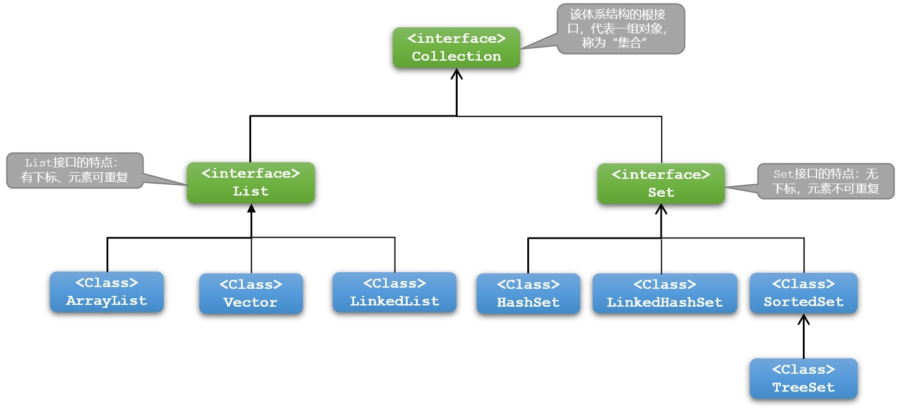
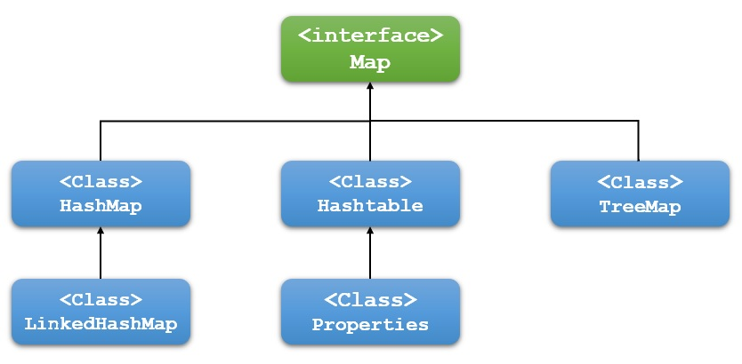
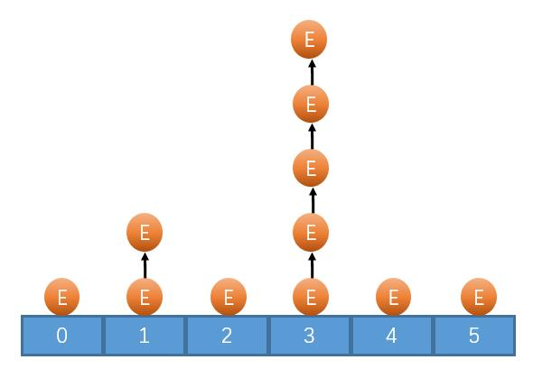
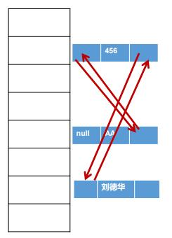

## 一、概述

### 1.1、什么是集合

> 存放对象的**容器**，定义了对多个对象进行操作的常用方法。可以实现类似数组的功能。
>
> 与数组的区别：
>
> * 数组长度固定，集合长度不固定；
> * 数组可以存储基本数据类型和引用数据类型，集合只能存储引用数据类型。
>
> 相关类所以位置：
>
> * `java.util包下`。

### 1.2、集合框架体系结构



> `Collection`体系集合
>
> 特点：代表一组任意类型的对象。
>
> 常用方法：
>
> * `boolean add(Object obj)`添加一个对象
> * `boolean addAll(Collection c)`将一共集合中的所有对象添加到此集合中
> * `void clear()`清空此集合中的所有对象
> * `boolean contains(Object o)`检查此集合中是否包含`o`对象
> * `boolean equals(Object o)`比较此集合是否与指定对象相等
> * `boolean isEmpty`判断此集合是否为空
> * `boolean remove(Object o)`在此集合中移除`o`对象
> * `int size()`返回此集合中的元素个数
> * `Object[] toArray()`将此集合转换成数组 



> `Map`体系集合
>
> 特点：称为`映射`存储一对数据`key-value`，键不可重复，值可以重复。
>
> 常用方法：
>
> * `V put(K key, V value)`将对象存入到集合中，关联键值。`key`重复则覆盖原值
> * `Object get(Object key)`根据键获取对应的值。
> * `Set<K> keySet()`返回所有`key`
> * `Collection<V> values()`返回包含所有值的`Collection`集合
> * `Set<Map.Entry<K,V>>`键值匹配的`Set`集合

## 二、`List`

> 特点：
>
> * 元素有序、且可重复的集合，集合中的每个元素都有其对应的顺序索引；
> * 允许使用重复元素，可以通过索引来访问指定位置的集合元素；
> * 默认按元素的添加顺序设置元素的索引。
>
> 相关实现类比较：
>
> * `ArrayList`
>   * **基于数组**结构实现，使用在查询比较多的场合下；
>   * JDK1.2出现，运行效率高，线程不安全。
> * `Vector`
>   * **基于数组**结构实现，使用在查询比较多的场合下；
>   * JDK1.0出现，运行效率低，线程安全。
> * `LinkedList`
>   * **基于链表**结构实现，增删快，查询慢。

### 2.1、`ArrayList`基本使用

> 基本操作：
>
> * `boolean add(E e)`添加元素
> * `void add(int index, E element)`添加元素到指定位置，`ArrayList`元素下标从`0`开始
> * `int size()`获取`ArrayList`长度
> * `E get(int index)`获取指定位置的元素
> * `boolean addAll(Collection<? extends E> c)`添加另外一个集合
> * `boolean addAll(int index,Collection<? extends E> c)`添加另外一个集合到指定位置
> * `void clear()`清空
> * `E set(int index, E element)`设置某个位置的元素
> * `boolean contains(Object o)`判断集合中是否包含某个元素
> * `E remove(int index)`删除指定位置的元素
> * `boolean remove(Object o)`删除特定元素
> * `int indexOf(Object o)`返回元素的索引

```java
//表示人的类
public class Person {
	private String id;//身份证号
	private String name;//姓名
	private int age;//年龄
	
    //get和set
    //toString
}

public class MyTest1 {
    public static void main(String[] args) {
        //创建ArrayList对象
        ArrayList list = new ArrayList();
        //添加元素
        list.add("JavaSE");
        list.add("MySQL");
        list.add("前端");
        list.add("JavaWeb");

        //获取ArrayList长度
        System.out.println("长度：" + list.size());
        //获取指定位置元素
        System.out.println(list.get(0));
        System.out.println(list.get(1));
        System.out.println(list.get(2));
        System.out.println(list.get(3));

        //返回元素所在的索引
        System.out.println("MySQL在集合中的位置为：" + list.indexOf("MySQL"));

        //在特定位置添加元素
        list.add(4, "SSM");
        System.out.println(list.get(4));
        System.out.println("--------------------------------------");
        //创建另一个集合
        ArrayList list1 = new ArrayList<>();
        list1.add("SpringBoot");
        list1.add("Vue");

        //在集合中添加另一个集合
        list.addAll(list1);
        System.out.println(list.get(5));
        System.out.println(list.get(6));

        //修改某个位置的元素
        list.set(4,"SSM框架");
        System.out.println(list.get(4));

        //删除特定位置的元素
        list.remove(4);
        System.out.println(list.get(4));
        //删除特定元素
        list.remove("JavaSE");
        System.out.println(list.get(0));

        //清空集合
        list.clear();
        System.out.println("清空集合后长度为：" + list.size());
        
        ArrayList list2 = new ArrayList();
        Person p1 = new Person();
        p1.setId("001");
        p1.setName("tom");
        p1.setAge(10);

        Person p2 = new Person();
        p2.setId("002");
        p2.setName("bob");
        p2.setAge(10);

        Person p3 = new Person();
        p3.setId("003");
        p3.setName("peter");
        p3.setAge(10);

        list2.add(p1);
        list2.add(p2);
        list2.add(p3);

        Person delP = new Person();
        delP.setId("002");
        delP.setName("bob");
        delP.setAge(10);

        /*
        * 如果根据“值”相同删除元素，一定要重写对象的equals方法
        */
        list2.remove(delP);

        System.out.println(list2.get(0));
        System.out.println(list2.get(1));
    }
}
```

### 2.2、`ArrayList`遍历

> `ArrayList`遍历的方式：
>
> * 普通`for`循环 --- `while`循环
> * 增强`for`循环
> * 使用迭代器遍历
> * 使用`Java8 Stream`流遍历（后面学习）
> * 使用`Java8`提供的默认方法`forEach`遍历（后面学习）

#### 2.2.1、普通`for`循环遍历

```java
public class MyTest2 {
    public static void main(String[] args) {
        //创建ArrayList对象
        ArrayList list = new ArrayList();
        //添加元素
        list.add("JavaSE");
        list.add("MySQL");
        list.add("前端");
        list.add("JavaWeb");

        //普通for循环遍历ArrayList
        for (int i = 0; i < list.size(); i++) {
            System.out.println(list.get(i));
        }
    }
}
```

#### 2.2.2、增强`for`循环遍历

```java
public class MyTest3 {
    public static void main(String[] args) {
        //创建ArrayList对象
        ArrayList list = new ArrayList();
        //添加元素
        list.add("JavaSE");
        list.add("MySQL");
        list.add("前端");
        list.add("JavaWeb");
        
        //增强for循环遍历ArrayList
        for (Object o : list) {
            System.out.println(o);
        }
    }
}
```

#### 2.2.3、迭代器遍历

```java
public class MyTest4 {
    public static void main(String[] args) {
        //创建ArrayList对象
        ArrayList list = new ArrayList();
        //添加元素
        list.add("JavaSE");
        list.add("MySQL");
        list.add("前端");
        list.add("JavaWeb");

        //获取迭代器
        Iterator it = list.iterator();

        //判断是否还有元素
        while (it.hasNext()) {
            //通过迭代器获取下一个元素
            Object item = it.next();
            System.out.println(item);
        }
        
        /*
		 *  ListIterator是List特有的迭代器
		 *  可以对List进行遍历
		 * */
		ListIterator<String> itList = list.listIterator();
		System.out.println(itList.hasPrevious());//判断前面还有没有元素
		System.out.println(itList.hasNext());//判断后面还有没有元素
		
		while(itList.hasNext()) {
            Object item = itList.next();
			System.out.println(item);
		}
    }
}
```

> 使用迭代器需要注意的问题：
>
> * 使用迭代器遍历元素，但是使用`List`自身的方法修改元素，导致迭代器无法发现元素长度改变，就会报错`ConcurrentModificationException`。
>
> 如何解决？
>
> * 使用迭代器自身的方法修改集合。

```java
public class MyTest5 {
    public static void main(String[] args) {
        //创建ArrayList对象
        ArrayList list = new ArrayList();
        //添加元素
        list.add("JavaSE");
        list.add("MySQL");
        list.add("前端");
        list.add("JavaWeb");

        //获取迭代器
        Iterator it = list.iterator();

        //判断是否还有元素
        while (it.hasNext()) {
            //通过迭代器获取下一个元素
            Object item = it.next();

            if(item.equals("MySQL")) {
                //list.remove("MySQL");
                //使用迭代器删除元素
                it.remove();
            }
        }

        //获取迭代器
        it = list.iterator();

        //判断是否还有元素
        while (it.hasNext()) {
            //通过迭代器获取下一个元素
            Object item = it.next();
            System.out.println(item);
        }
    }
}
```

### 2.3、泛型

#### 2.3.1、概述

> 泛型可以理解为`标签`
>
> * 中药店，每个抽屉外面贴着标签；
> * 超市购物架上很多瓶子，每个瓶子装的是什么，有标签。
>
> 集合在设计阶段/声明阶段不能确定这个容器到底实际存的是什么类型的对象，所以在`JDK1.5`之前只能把元素类型设计为`Object`，`JDK1.5`之后使用泛型来解决。因为这个时候除了元素的类型不确定，其他的部分是确定的，例如关于这个元素如何保存，如何管理等是确定的，因此此时把元素的类型设计成一个参数，这个类型参数叫做**泛型**。`Collection<E>`，`List<E>`，`ArrayList<E>` 这个`<E>`就是类型参数，即**泛型**。
>
> 所谓**泛型**，就是允许在定义类、接口时通过一个标识**表示类中某个属性的类型或者是某个方法的返回值及参数类型**。这个类型参数将在使用时（例如，继承或实现这个接口，用这个类型声明变量、创建对象时）确定（即传入实际的类型参数，也称为类型实参）。
>
> 从`JDK1.5`以后，`Java`引入了`参数化类型（Parameterized type）`的概念，允许我们在创建集合时再指定集合元素的类型，正如：`List<String>`，这表明该`List`只能保存字符串类型的对象。
>
> `JDK1.5`改写了集合框架中的全部接口和类，为这些接口、类增加了泛型支持，从而可以在声明集合变量、创建集合对象时传入类型实参。

#### 2.3.2、为什么要有泛型

> 那么为什么要有泛型呢，直接Object不是也可以存储数据吗？
>
> * 解决元素存储的安全性问题，好比商品、药品标签，不会弄错。
> * 解决获取数据元素时，需要类型强制转换的问题，好比不用每回拿商品、药品都要辨别。
>
> 集合中没有泛型时：
>
> * `String`类型对象添加到集合中，在集合中当成`Object`类型对象；
> * 从集合中获取，读取到的对象只能被当成`Object`类的对象读取；
> * 如果我们希望将读取到的对象当成`String`类的对象使用，需要**向下转型**；
> * 转换过程繁琐，而且可能出现`ClassCastException`异常。
>
> 集合中有泛型时：
>
> * `String`类型对象添加到集合中，在集合中当成`String`类型对象；
> * 从集合中获取，读取到的对象被当成`String`类的对象读取，不需要**向下转型**。
>
> Java泛型可以保证如果程序在编译时没有发出警告，运行时就不会产生`ClassCastException`异常。同时，代码更加简洁、健壮。

#### 2.3.3、在集合中使用泛型

```java
public class MyTest6 {
    public static void main(String[] args) {
        //创建ArrayList，使用泛型
        ArrayList<String> list = new ArrayList<>();
        list.add("JavaSE");
        list.add("MySQL");
        list.add("前端");
        list.add("JavaWeb");

        for (String s : list) {
            System.out.println(list);
        }
        
        Iterator<String> iterator = list.iterator();
        while (iterator.hasNext()) {
            String s = iterator.next();
            System.out.println(s);
        }
    }
}
```

> 总结起来：泛型就是**约束**集合存放元素的类型用的，是告诉编译器**集合存放什么类型**，是能够在编译时而不是在运行时检测错误。

#### 2.3.4、泛型类及泛型接口

> 泛型的声明：
>
> `interface List<T>` 和`class GenTest<K,V>` 其中，`T,K,V`不代表值，而是表示类型。这里**使用任意字母都可以**。常用`T`表示，是`Type`的缩写。
>
> 

```java
//定义带泛型的类
public class MyClass1<T> {
    public void m1(T t) {

    }
}

//定义泛型接口
public interface MyInterface<T> {
    void m1(T t);
}

//定义实现泛型接口的类
public class MyClass2<T> implements MyInterface<T> {
    @Override
    public void m1(T t) {

    }
}

//定义继承泛型类的类
public class MyClass3<T> extends MyClass1<T> {
    @Override
    public void m1(T t) {
        super.m1(t);
    }
}

public class MyTest7 {
    public static void main(String[] args) {
        MyClass1<String> myClass1 = new MyClass1<>();
        myClass1.m1("aaa");

        MyClass2<String> myClass2 = new MyClass2<>();
        myClass2.m1("bbb");
        
        MyClass3<String> myClass3 = new MyClass3<>();
        myClass3.m1("hello");
    }
}
```

#### 2.3.5、泛型方法

> 方法，也可以被泛型化，不管此时定义在其中的类是不是泛型类。在泛型方法中可以定义泛型参数，此时，**参数的类型就是传入数据的类型**。
>
> **为什么要使用泛型方法呢**？因为泛型类要在实例化的时候就指明类型，如果想换一种类型，不得不重新`new`一次，可能不够灵活；而泛型方法可以在调用的时候指明类型，更加灵活。
>
> 格式：
>
> ```java
> [访问权限] <泛型> 返回类型 方法名([泛型标识 参数名称]) 抛出的异常
> ```

```java
//定义带泛型的类
public class MyClass1<T> {
    public void m1(T t) {

    }
    
    //泛型方法
    public <E> void m2(E e) {

    }
	
    /*
        public int add(int a, int b) {
            System.out.println(a + "+" + b + "=" + (a + b));
            return a + b;
        }

        public float add(float a, float b) {
            System.out.println(a + "+" + b + "=" + (a + b));
            return a + b;
        }

        public double add(double a, double b) {
            System.out.println(a + "+" + b + "=" + (a + b));
            return a + b;
        }
    */
    //如果没有泛型，要实现不同类型的加法，每种类型都需要重载一个add方法；通过泛型，我们可以复用为一个方法
    public <T extends Number> double add(T a, T b) {
        System.out.println(a + "+" + b + "=" + (a.doubleValue() + b.doubleValue()));
        return a.doubleValue() + b.doubleValue();
    }
}

public class MyTest8 {
    public static void main(String[] args) {
        MyClass1<String> myClass1 = new MyClass1<>();
        myClass1.m1("aaa");

        Person p = new Person();
        p.setId("001");
        p.setName("zs");
        p.setAge(20);
		
        //调用泛型方法
        myClass1.m2(p);
        //调用被static修饰的泛型方法
        System.out.println(test(123));
    }
    
    //static的泛型方法
    public static <T> T test(T t) {
        return t;
    }   
}
```

#### 2.3.6、通配符

> `<?>`代表任意类型数据
>
> `<? extends 类型>`使用时指定的类型必须是继承某个类，或者实现某个接口，即`<=` 
>
> `<? super 类型>`使用时指定的类型不能小于操作的类，即`>=`
>
> 举例：
>
> * `<? extends Person> `(无穷小 ,Person]只允许泛型为`Person`及`Person`子类的引用调用；
> * `<? super Person>`[Person, 无穷大)只允许泛型为`Person`及`Person`父类的引用调用。

### 2.4、`Collections`

#### 2.4.1、`Java`比较器

> Java中的对象，正常情况下，只能进行比较：`==`或 `!=` ，不能使用`>`或`<`进行比较。
>
> * 但是在开发场景中，我们**需要对多个对象进行排序**，言外之意，就**需要比较对象的大小**。
> * 如何实现？使用两个接口中的任何一个：`Comparable`或`Comparator`

##### 2.4.1.1、`Comparable`自然排序

> `Comparable`接口强行对实现它的每个类的对象进行整体排序。这种排序被称为类的**自然排序**。
>
> * 像`String`、`包装类`等实现了`Comparable`接口，重写了`compareTo(obj)`方法，给出了比较两个对象大小的方式；
> * 像String、包装类重写`compareTo()`方法以后，进行了从**小到大**的排列，重写`compareTo(obj)`的规则：
>   * 如果当前对象`this`大于形参对象`obj`，则返回正整数；
>   * 如果当前对象`this`小于形参对象`obj`，则返回负整数；
>   * 如果当前对象`this`等于形参对象`obj`，则返回零。
> * 对于**自定义类**来说，如果需要排序，我们可以让自定义类实现`Comparable`接口，重写`compareTo(obj)`方法。在`compareTo(obj)`方法中指明如何排序；
> * 实现`Comparable`接口的对象列表（和数组）可以通过`Collections.sort()`或`Arrays.sort()`进行自动排序。

```java
public class MyTest9 {
    public static void main(String[] args) {
        String[] strArr = {"AA", "AAB", "aab", "ee", "FF"};
        //String类型排序，小-大
        Arrays.sort(strArr);
        System.out.println(Arrays.toString(strArr));

        Double[] doubleArr = {99.5, 100.9, 23.0};
        //Double类型排序，小-大
        Arrays.sort(doubleArr);
        System.out.println(Arrays.toString(doubleArr));
    }
}
```

> 自定义`Person`类型排序

```java
//表示人的类，实现了Comparable接口，用于自然排序
public class Person implements Comparable<Person> {
	private String id;//身份证号
	private String name;//姓名
	private int age;//年龄

    //构造方法 有参/无参
    //get/set
    //equals/hashCode

	@Override
	public int compareTo(Person o) {
		//if(this.age > o.getAge()) {
		//	return 1;
		//} else if(this.age < o.getAge()) {
		//	return -1;
		//} else {
		//	return 0;
		//}
        //根据年龄升序排序
		int compareAge = Integer.compare(this.age, o.getAge());
		if(compareAge == 0) {
            //如果年龄相同根据id降序排序
			return -this.id.compareTo(o.id);
		} else {
			return compareAge;
		}
	}
}

public class MyTest10 {
    public static void main(String[] args) {
        Person p1 = new Person("111", "zs", 25);
        Person p2 = new Person("112", "ls", 19);
        Person p3 = new Person("115", "ls", 19);
        Person p4 = new Person("113", "ww", 21);

        Person[] arr = {p1, p2, p3, p4};
        //自然排序
        //如果Person不实现Comparable接口，会出现ClassCastException
        Arrays.sort(arr);
        System.out.println(Arrays.toString(arr));
    }
}
```

##### 2.4.1.2、`Comparator`定制排序

> 当元素的类型没有实现`java.lang.Comparable`接口而又**不方便修改代码**，或者实现了`java.lang.Comparable`接口的排序规则不适合当前的操作，那么可以考虑使用`Comparator`的对象来排序，强行对多个对象进行整体排
> 序的比较，这种排序称为**定制排序**。
>
> 重写`compare(Object o1,Object o2)`方法，比较`o1`和`o2`的大小：
>
> * 返回正整数，则表示`o1`大于`o2`；
> * 返回`0`，表示相等；
> * 返回负整数，表示`o1`小于`o2`。
>
> 可以将`Comparator`传递给`sort`方法（如 `Collections.sort()`或`Arrays.sort()`），从而允许在排序顺序上实现精确控制。

```java
public class MyTest11 {
    public static void main(String[] args) {
        String[] strArr = {"aa", "bb", "AA", "EE", "AAB"};
        System.out.println(Arrays.toString(strArr));
        //Arrays.sort(arr)默认按照升序排序，如果要降序排序，需要使用定制排序
        Arrays.sort(strArr, new Comparator<String>() {
            @Override
            public int compare(String o1, String o2) {
                return -o1.compareTo(o2);
            }
        });
        System.out.println(Arrays.toString(strArr));
        
        Person p1 = new Person("111", "zs", 25);
        Person p2 = new Person("112", "ls", 19);
        Person p3 = new Person("115", "ls", 19);
        Person p4 = new Person("113", "ww", 21);

        Person[] arr = {p1, p2, p3, p4};
        /**
         * 使用匿名内部类，该类实现了Comparator接口
         */
        Arrays.sort(arr, new Comparator<Person>() {
            @Override
            public int compare(Person o1, Person o2) {
                //根据age降序排序
                int compareAge = Integer.compare(o1.getAge(), o2.getAge());
                if(compareAge == 0) {
                    //age相同，根据id升序排序
                    return o1.getId().compareTo(o2.getId());
                } else {
                    return -compareAge;
                }
            }
        });

        System.out.println(Arrays.toString(arr));
    }
}
```

#### 2.4.2、`Collections`常用方法

> `Collections`是一个操作`List `、`Set`和`Map`等集合的工具类。
>
> `Collections`中提供了一系列静态的方法对集合元素进行排序、查询和修改等操作，还提供了对集合对象设置不可变、对集合对象实现同步控制等方法。
>
> 排序操作(均为`static`方法)：
>
> * `reverse(List<?> list)`：反转`List`中元素的顺序；
>
> * `shuffle(List<?> list)`：对`List`集合元素进行随机排序；
> * `sort(List<T> list)`：根据元素的**自然顺序**对指定`List`集合元素按升序排序；
> * `sort(List<T> list, Comparator<? super T> c)`：根据指定的`Comparator`产生的顺序对`List`集合元素进行**定制排序**；
> * `swap(List<?> list, int i, int j)`：将指定`List`集合中的`i`处元素和`j`处元素进行交换。

```java
public class MyTest12 {
    public static void main(String[] args) {
        ArrayList<String> list = new ArrayList<>();
        list.add("abc");
        list.add("AA");
        list.add("ABC");
        list.add("EE");

        System.out.println(list);
        //反转
        Collections.sort(list);
        System.out.println(list);
        //随机排序
        Collections.shuffle(list);
        System.out.println(list);
        //自然排序
        Collections.sort(list);
        System.out.println(list);
        //定制排序
        Collections.sort(list, new Comparator<String>() {
            @Override
            public int compare(String o1, String o2) {
                return -o1.compareTo(o2);
            }
        });
        System.out.println(list);

        //交换特定位置的元素
        Collections.swap(list, 0, list.size() - 1);
        System.out.println(list);


        Person p1 = new Person("111", "zs", 25);
        Person p2 = new Person("112", "ls", 19);
        Person p3 = new Person("115", "ls", 19);
        Person p4 = new Person("113", "ww", 21);

        ArrayList<Person> personList = new ArrayList<>();
        personList.add(p1);
        personList.add(p2);
        personList.add(p3);
        personList.add(p4);

        System.out.println(personList);
        //自然排序，自定义类实现Comparable接口
        Collections.sort(personList);
        System.out.println(personList);
        //定制排序，使用匿名内部类对象
        Collections.sort(personList, new Comparator<Person>() {
            @Override
            public int compare(Person o1, Person o2) {
                return -o1.getId().compareTo(o2.getId());
            }
        });
        System.out.println(personList);
    }
}
```

> 查找、替换(均为`static`方法)：
>
> * `Object max(Collection)`：根据元素的自然顺序，返回给定集合中的最大元素
> * `Object max(Collection，Comparator)`：根据`Comparator`指定的顺序，返回给定集合中的最大元素
> * `Object min(Collection)`：根据元素的自然顺序，返回给定集合中的最小元素
> * `Object min(Collection，Comparator)`：根据`Comparator`指定的顺序，返回给定集合中的最小元素
> * `int frequency(Collection，Object)`：返回指定集合中指定元素的出现次数
> * `void copy(List dest,List src)`：将`src`中的内容复制到`dest`中
> * `boolean replaceAll(List list，Object oldVal，Object newVal)`：使用新值替换`List`对象的所有旧值

```java
public class MyTest13 {
    public static void main(String[] args) {
        ArrayList<String> list = new ArrayList<>();
        list.add("abc");
        list.add("AA");
        list.add("ABC");
        list.add("EE");
        //最大值 最小值
        System.out.println(Collections.max(list));
        System.out.println(Collections.min(list));
        System.out.println(Collections.max(list, new Comparator<String>() {
            @Override
            public int compare(String o1, String o2) {
                return -o1.compareTo(o2);
            }
        }));

        System.out.println(Collections.min(list, new Comparator<String>() {
            @Override
            public int compare(String o1, String o2) {
                return -o1.compareTo(o2);
            }
        }));
        //出现次数
        System.out.println(Collections.frequency(list, "AA"));

        //复制
        List<String> list1 = Arrays.asList(new String[list.size()]);
        Collections.copy(list1, list);
        System.out.println(list1);

        //替换
        Collections.replaceAll(list, "AA", "******");
        System.out.println(list);
    }
}
```

> `Collections`类中提供了多个`synchronizedXxx()`方法，该方法可使将指定集合包装成线程同步的集合，从而可以解决多线程并发访问集合时的线程安全问题。
>
> * `static <T> Collection<T> synchronizedCollection(Collection<T> c)`
> * `static <T> List<T> synchronizedList(List<T> list)`
> * `static <K,V> Map<K,V> synchronizedMap(Map<K,V> m)`
> * `static <T> Set<T> synchronizedSet(Set<T> s)`
> * `...`

## 三、`Set`

### 3.1、`Set`概述

> `Set`接口是`Collection`的子接口，`Set`接口没有提供额外的方法。
>
> `Set`集合**不允许包含相同的元素**，如果试图把两个相同的元素加入同一个`Set`集合中，则添加操作失败。
>
> `Set`判断两个对象是否相同不是使用`==`运算符，而是根据`equals()`方法。
>
> `Set`接口实现类比较：
>
> * `HashSet`作为`Set`接口的主要实现类，线程不安全的，可以存储`null`值；
> * `LinkedHashSet`作为`HashSet`的子类，遍历其内部数据时，可以按照添加的顺序遍历，对于频繁的遍历操作，`LinkedHashSet`效率高于`HashSet`；
> * `TreeSet`可以按照添加对象的指定属性，进行排序。
>
> 如何遍历`Set`：
>
> * 增强`for`循环；
> * 迭代器。

```java
public class MyTest14 {
    public static void main(String[] args) {
        HashSet<String> set = new HashSet<>();
        set.add("JavaSE");
        set.add("MySQL");
        set.add("JDBC");
        set.add("JavaWeb");
        set.add("JDBC");

        //使用增强for循环遍历
        for(String item : set) {
            System.out.println(item);
        }
        System.out.println("-------------------------------");
        //使用迭代器遍历
        Iterator<String> iterator = set.iterator();
        while (iterator.hasNext()) {
            String s = iterator.next();
            System.out.println(s);
        }
    }
}
```

### 3.2、`HashSet`

> `HashSet`是`Set`接口的典型实现，大多数时候使用`Set`集合时都使用这个实现类。
>
> `HashSet`按`Hash`算法来存储集合中的元素，因此具有很好的存取、查找、删除性能
>
> `HashSet`具有以下特点：
>
> * 不能保证元素的排列顺序；
> * 元素不能重复；
> * `HashSet`不是线程安全的；
> * 集合元素可以是`null`。
>
> `HashSet`集合判断两个元素相等的标准：两个对象通过`hashCode()`方法比较相等，并且两个对象的`equals()`方法返回值也相等。
>
> 对于存放在`Set`容器中的对象，对应的类一定要重写`equals()`和`hashCode()`方法，以实现对象相等规则。即：**相等的对象必须具有相等的散列码**。

#### 3.2.1、`Set`的无序性和不可重复性

> 以`HashSet`为例说明：
>
> * **无序性**：不等于随机性（`MyTest14`的程序每次遍历的结果都是相同的）。存储的数据在底层数组中并非按照数组索引的顺序添加，而是根据数据的哈希值决定的。
> * **不可重复性**：保证添加的元素按照`equals()`判断时，不能返回`true`。即：相同的元素只能添加一个。

```java
//表示学生的类
public class Student {
    private String id;
    private String name;
    private String age;
    
    //有参和无参构造方法
    //get和set方法
    //toString方法
    //equals和hashCode方法
}

public class MyTest15 {
    public static void main(String[] args) {
        Student p1 = new Student("001", "Tom", 20);
        Student p2 = new Student("002", "Bob", 21);
        Student p3 = new Student("002", "Bob", 21);
        Student p4 = new Student("003", "Smith", 22);

        HashSet<Student> set = new HashSet<>();
        set.add(p1);
        set.add(p2);
        set.add(p3);
        set.add(p4);

        /*
        	没有重写equals()和hashCode()方法，重复元素能够重复添加。
        */
        for (Student s : set) {
            System.out.println(s);
        }
    }
}
```

> `HashSet`中元素的添加过程：
>
> * 当向`HashSet`集合中存入一个元素时，`HashSet`会调用该对象的`hashCode()`方法来得到该对象的 `hashCode()`值，然后根据`hashCode()`值，通过某种散列函数决定该对象在`HashSet`底层数组中的存储位置。
>   * 如果此位置上没有其他元素，则添加成功；
>   * 如果此位置上有其他元素，则进行进一步比较。
>
> * 比较两元素的`hashCode()`的值：
>   * 如果两个元素的`hashCode()`值不相等，添加成功；
>   * 如果两个元素的`hashCode()`值相等，会再继续调用`equals()`方法，如果`equals()`方法结果为`true`，添加失败；如果为`false`，那么会添加该元素，但是该数组的位置已经有元素了，那么会通过**链表**的方式继续链接。
>
>
> `HashSet`底层结构：**数组+链表**
>
> 如果两个元素的`equals()`方法返回`true`，但它们的`hashCode()`返回值不相等`HashSet`将会把它们存储在不同的位置，但依然可以添加成功。



#### 3.2.2、重写`hashCode()`方法和`equals()`方法的原则

> 重写`hashCode()`方法原则：
>
> * 在程序运行时，同一个对象多次调用`hashCode()`方法应该返回相同的值；
> * 当两个对象的`equals()`方法比较返回`true`时，这两个对象的`hashCode()` 方法的返回值也应相等；
> * 对象中用作`equals()`方法比较的属性，都应该用来计算`hashCode`值。
>
> 重写`equals()`方法原则：
>
> * 当一个类有自己特有的**逻辑相等**概念，当改写`equals()`的时候，总是要改写`hashCode()`，根据一个类的`equals`方法（改写后），两个截然不同的实例有可能在逻辑上是相等的，但是，根据`Object.hashCode()`方法，它们仅仅是两个对象。
> * 因此，违反了**相等的对象必须具有相等的散列码**。
> * 结论：复写`equals()`方法的时候一般都需要同时复写`hashCode`方法。通常参与计算`hashCode`的对象的属性也应该参与到`equals()`中进行计算。

### 3.3、`LinkedHashSet`使用

> `LinkedHashSet`是`HashSet`的子类
>
> * `LinkedHashSet`根据元素的`hashCode`值来决定元素的存储位置，但它同时使用**双向链表**维护元素的次序，这使得元素看起来是以插入顺序保存的。
> * `LinkedHashSet`插入性能略低于`HashSet`，但在迭代访问`Set`里的全部元素时有很好的性能
> * `LinkedHashSet`不允许集合元素重复。

```java
public class MyTest16 {
    public static void main(String[] args) {
        LinkedHashSet<String> set = new LinkedHashSet<>();
        set.add("JavaSE");
        set.add("MySQL");
        set.add("JDBC");
        set.add("JavaWeb");
        set.add("JDBC");

        //使用增强for循环遍历
        for(String item : set) {
            System.out.println(item);
        }
    }
}
```



### 3.4、`TreeSet`使用

> `TreeSet`是`SortedSet`接口的实现类，`TreeSet`可以确保集合元素处于排序状态。
>
> `TreeSet`底层使用**红黑树**结构存储数据。
>
> `TreeSet`两种排序方法：**自然排序和定制排序**。默认情况下，`TreeSet`采用自然排序。

```java
public class MyTest17 {
    public static void main(String[] args) {
        //默认使用自然排序在TreeSet中排序
        TreeSet<String> set = new TreeSet<>();
        set.add("123");
        set.add("abc");
        set.add("aBc");
        set.add("AA");
        set.add("EE");

        for (String s : set) {
            System.out.println(s);
        }
        System.out.println("-----------------------------------------");

        TreeSet<String> set1 = new TreeSet<>(new Comparator<String>() {
            @Override
            public int compare(String o1, String o2) {
                return -o1.compareTo(o2);
            }
        });

        set1.add("123");
        set1.add("abc");
        set1.add("aBc");
        set1.add("AA");
        set1.add("EE");

        for (String s : set1) {
            System.out.println(s);
        }
    }
}
```

## 四、`Map`

> `Map`与`Collection`并列存在。用于保存具有映射关系的数据：`key-value`
>
> `Map`中的`key`和`value`都可以是任何引用类型的数据。
>
> `Map`中的`key`用`Set`来存放，不允许重复，`key`所对应的类，须重写`hashCode()`和`equals()`方法。常用`String`类作为`Map`的`key`。
>
> `key`和`value`之间存在单向一对一关系，即通过指定的`key`总能找到唯一的、确定的`value`
>
> `Map`接口的常用实现类：`HashMap`、`TreeMap`、`LinkedHashMap`和`Properties`。其中，`HashMap`是`Map`接口使用频率最高的实现类。
>
> * `HashMap`：`Map`的主要实现类，线程不安全，效率高，可以存放为`null`的`key`和
>
>   `value`；
>
> * `LinkedHashMap`：保证在遍历`Map`元素时，可以按照添加的顺序实现遍历(在原有的`HashMap`底层结构基础上，添加了一对指针，指向前一个和后一个元素)。对于频繁的遍历操作，此类执行效率高于`HashMap`。
>
> * `TreeMap`：可以按照添加`key-value`中`key`的指定属性，进行排序，底层使用红黑树。
>
> * `Hashtable`：古老的实现类，线程安全的，效率低，不能存储`null`的`key`和`value`。
>
> * `Properties`：常用来处理配置文件。`key`和`value`都是`String`类型。
>
> 常用方法：
>
> * 添加、删除、修改操作
>   * `Object put(Object key,Object value)`：将指定`key-value`添加到(或修改)当前`map`对象中
>   * `void putAll(Map m)`：将`m`中的所有`key-value`对存放到当前`map`中
>   * `Object remove(Object key)`：移除指定`key`的`key-value`对，并返回`value`
>   * `void clear()`：清空当前`Map`中的所有数据
> * 查询操作
>   * `Object get(Object key)`：获取指定`key`对应的`value`
>   * `boolean containsKey(Object key)`：是否包含指定的`key`
>   * `boolean containsValue(Object value)`：是否包含指定的`value`
>   * `int size()`：返回`map`中`key-value`对的个数
>   * `boolean isEmpty()`：判断当前`map`是否为空
>   * `boolean equals(Object obj)`：判断当前`map`和参数对象`obj`是否相等
> * 其他操作
>   * `Set keySet()`：返回所有`key`构成的`Set`集合
>   * `Collection values()`：返回所有`value`构成的`Collection`集合
>   * `Set entrySet()`：返回所有`key-value`对构成的`Set`集合

### 4.1、`HashMap`

> `HashMap`是`Map`接口使用频率最高的实现类。
>
> * 允许使用`null`键和`null`值，与`HashSet`一样，不保证映射的顺序；
> * 所有的`key`构成的集合是`Set`：无序的、不可重复的。所以，`key`所在的类要重写：`equals()`和`hashCode()`。
>
> 基本操作演示：

```java
//Map基本操作
public class MyTest18 {
    public static void main(String[] args) {
        HashMap<String, String> map = new HashMap<>();
        //添加元素
        map.put("1", "zs");
        map.put("2111", "ls");
        map.put("32211", "ww");

        System.out.println(map);
        System.out.println("---------------------------");
        //添加另一个map
        HashMap<String, String> map1 = new HashMap<>();
        map1.put("4122", "tom");
        map1.put("533", "bob");
        map.putAll(map1);
        System.out.println(map);
        System.out.println("---------------------------");
        //删除
        map.remove("533");
        System.out.println(map);
        //通过key获取对应的value
        System.out.println(map.get("1"));
        //判断是否包含对应的key
        System.out.println(map.containsKey("1"));
        //判断是否包含对应的value
        System.out.println(map.containsValue("zs"));
        //返回键值对个数
        System.out.println(map.size());
        //判断map是否为空
        System.out.println(map.isEmpty());
        //清空map
        map.clear();
        System.out.println(map);
    }
}

```

> `Map`遍历演示：

```java
public class MyTest19 {
    public static void main(String[] args) {
        HashMap<String, String> map = new HashMap<>();
        //添加元素
        map.put("1", "zs");
        map.put("2111", "ls");
        map.put("32211", "ww");

        /**
         * 遍历map所有的key
         * 1.获取所有的key
         * 2.遍历
         */
        Set<String> set = map.keySet();
        for (String s : set) {
            System.out.println(s);
        }

        /**
         * 遍历map所有的value
         * 1.获取所有的value
         * 2.遍历
         */
        Collection<String> values = map.values();
        for (String value : values) {
            System.out.println(value);
        }

        /**
         * 遍历map所有的键值对 方式1
         * 1.获取所有的key
         * 2.遍历key
         * 3.遍历key的过程中获取key对应的value
         */
        Set<String> keys = map.keySet();
        for (String k : keys) {
            String v = map.get(k);
            System.out.println(k + ":" + v);
        }

        /**
         * 遍历map所有的键值对 方式2
         * 1.获取Entry
         * 2.遍历所有的Entry
         */
        Set<Map.Entry<String, String>> entrySet = map.entrySet();
        for (Map.Entry<String, String> entry : entrySet) {
            String key = entry.getKey();
            String value = entry.getValue();
            System.out.println(key + ":" + value);
        }
    }
}
```

### 4.2、`LinkedHashMap`

> 元素包含指向前后元素的指针，能够记录添加的元素的先后顺序。

```java
public class MyTest20 {
    public static void main(String[] args) {
        LinkedHashMap<String, String> map = new LinkedHashMap<>();
        map.put("aaaa", "123");
        map.put("11", "tom");
        map.put("abc", "smith");
        
        Set<String> keys = map.keySet();
        for (String k : keys) {
            String v = map.get(k);
            System.out.println(k + ":" + v);
        }
    }
}
```

### 4.3、`TreeMap`

> 可以按照添加`key-value`中`key`的指定属性，进行排序，底层使用红黑树。

```java
public class MyTest21 {
    public static void main(String[] args) {
        TreeMap<String, String> map = new TreeMap<>();
        map.put("EE", "aaa");
        map.put("dd", "aaa");
        map.put("11", "aaa");
        map.put("abc", "aaa");
        map.put("AA", "aaa");
        map.put("Abc", "aaa");

        Set<String> set = map.keySet();
        for (String k : set) {
            System.out.println(k + "-" + map.get(k));
        }
        System.out.println("===========================================================");

        TreeMap<String, String> map1 = new TreeMap<>(new Comparator<String>() {
            @Override
            public int compare(String o1, String o2) {
                return -o1.compareTo(o2);
            }
        });
        map1.put("EE", "aaa");
        map1.put("dd", "aaa");
        map1.put("11", "aaa");
        map1.put("abc", "aaa");
        map1.put("AA", "aaa");
        map1.put("Abc", "aaa");

        set = map1.keySet();
        for (String k : set) {
            System.out.println(k + "-" + map.get(k));
        }
    }
}
```

### 4.4、`Properties`

> `Properties`类是`Hashtable`的子类，该对象用于处理属性文件，由于属性文件里的`key`、`value`都是字符串类型，所以`Properties`里的`key`和`value`都是字符串类型。
>
> 存取数据时，建议使用`setProperty(String key,String value)`方法和`getProperty(String key)`方法。

```java
import java.io.FileInputStream;
import java.io.IOException;
import java.util.Properties;

public class MyTest19 {
    public static void main(String[] args) throws IOException {
        //创建Properties
        Properties prop = new Properties();
        //加载配置文件
        prop.load(new FileInputStream("jdbc.properties"));
        //获取配置文件中key对应的value
        String username = prop.getProperty("username");
        String password = prop.getProperty("password");
        System.out.println(username);
        System.out.println(password);
    }
}
```

> `jdbc.properties`

```properties
username=root
password=root
```

